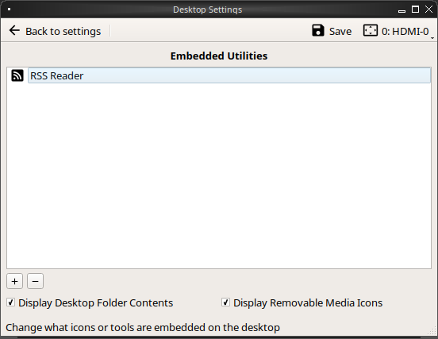
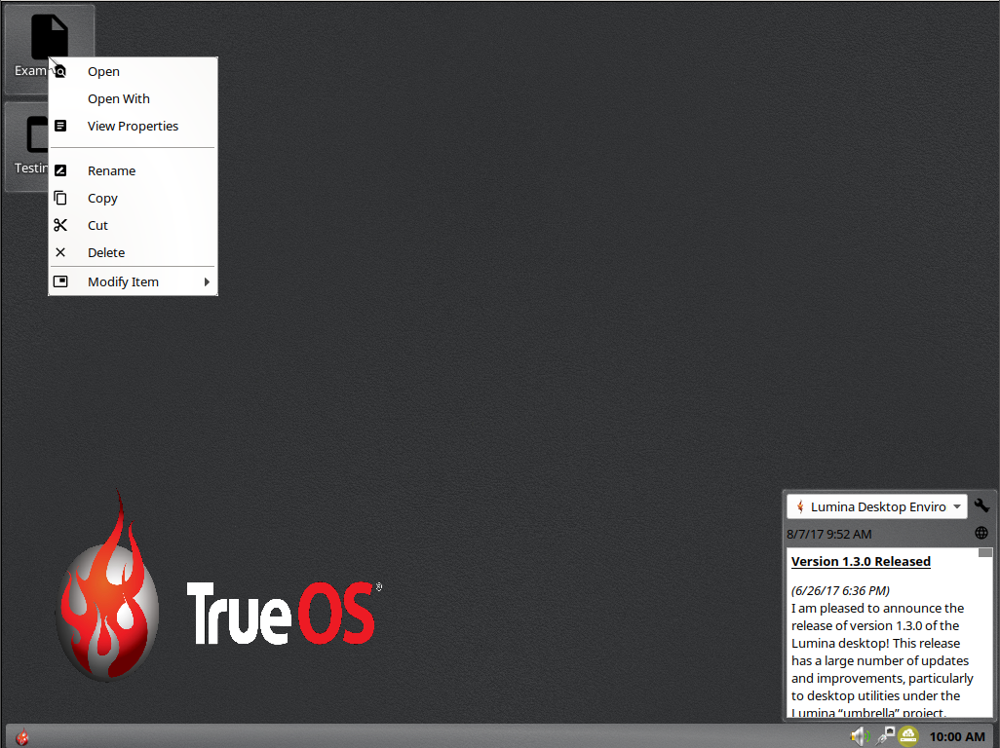

Configuration
=============

The |lumina| Configuration utility, shown in Figure %s \<lumina3\>, is used to configure every aspect of the desktop and is the recommended way to make changes. To launch this utility, click Start menu --\> Preferences --\> Configure Desktop, or right-click the desktop and hover over Preferences and click All Desktop Settings, or type lumina-config in a Command Line Interface (CLI). If all those options are unavailable, the *Desktop Configuration* application (under the Settings category) also opens the configuration utility. For convenience, the Preferences section of the right-click menu also lists the commonly used sub-elements of **Screensaver**, **Wallpaper**, and **Display** from within the Configuration utility.

Under the top search bar are options to configure different areas of the system. By default, each category is expanded to provide an efficient view of all available configuration options. Click an option to view more details and tunables.

> **note**
>
> If you make changes to any of the options, remember to click Save before exiting this utility in order to save them. |lumina| prompts for a decision if any unsaved changes are present when attempting to navigate away from the current settings area.

The rest of this section describes the available configurations in each category.

Appearance
----------

This category changes the visual appearance and functionality of the desktop on a per-screen basis.

### Theme Settings

The Theme option, shown in Figure %s \<lumina17\>, is used to change the default font, font size, theme template, color scheme, icon pack, and mouse cursors.

It is possible to create personalized theme templates or color schemes by clicking Edit next to those options and changing the settings as necessary. Figure %s \<lumina18\> shows an example of clicking Edit on the Glass (System) theme template. The Theme Editor opens and the user clicks the color selector (dropper icon) in the upper right corner. Selecting an item in this menu edits the template by changing the values in the theme editor box.

> **note**
>
> Theme templates are written as [Qt stylesheets](http://doc.qt.io/qt-5/stylesheet.html). Scripting experience is helpful when configuring a theme.

When making changes, be sure to click Save to save the theme without closing the editor, or click Apply, which both saves the theme and closes the editor.

The Application Themes tab, seen in Figure %s \<appthemes\>, allows the user to easily apply any installed Qt5 theme engines to any Qt based applications.

Select the Qt5 Theme Engine drop down menu to choose between the defaults of **None** or **Manual Setting**. Any user installed theme engines will also appear in this drop down menu.

### Wallpaper

The Wallpaper option, shown in Figure %s \<lumina27\>, can be used to add or remove a wallpaper with the + or - buttons, respectively. When + is pressed, the drop-down menu can be used to select the file(s), a single directory, a directory and all of its subdirectories, or a solid color to use as the wallpaper. If multiple images are selected, Rotate Background can be selected as well as a specified time interval in minutes to move to the next image.

Click the Layout drop-down menu to change the default layout of Automatic to one of several options: *Fullscreen*, *Fit screen*, *Tile*, *Center*, *Top Left*, *Top Right*, *Bottom Left*, or *Bottom Right*.

Click + --\> Solid Color to view all the wallpaper options shown in Figure %s \<lumina16\>. Select a color and click OK to add that color as a solid background to the wallpaper selection drop-down menu.

### Window Effects

Window Effects, shown in Figure %s \<lumina28\>, is used to add or alter graphical effects or animations applied to your windows. By default, no additional effects are added. Any desired changes need to be adjusted manually.

Disable the Compositing Manager by checking its associated box. Restarting the current session is required for any changes to take effect. By default, Only use compositing with GPU acceleration is selected, which improves system performance.

### Window Manager

Window Manager, shown in Figure %s \<lumina22\>, contains various configuration options for the window manager.

Drop-down menus are provided for configuring all options:

-   **Number of Workspaces:** A maximum of *10* workspaces can be defined, with a default of *2*.
-   **New Window Placement:** Indicates where new windows are placed on the screen. Choices are *Align in a Row*, *Align in a Column*, *Cascade", or*Underneath Mouse\*.
-   **Focus Policy:** Indicates when windows receive focus. Choices are *Click to Focus*, *Active Mouse Focus*, or *Strict Mouse Focus*.
-   **Window Theme:** Controls the appearance of the frame around application windows. The Window Theme Preview box previews the selected theme.

The Advanced Editor, seen in Figure %s \<lumina29\>, provides options to manually adjust every setting related to the display of windows on the system.

Desktop Defaults
----------------

The Desktop Defaults category, seen in Figure %s \<lumina3\>, is used to configure which applications automatically start on login in to |lumina|, the default applications and file types, and keyboard shortcuts.

### Applications

Click Applications to view the default applications Basic Settings tab, shown in Figure %s \<lumina24\>. This tab can be used to configure default applications.

The default *web browser*, *email client*, *file manager*, and *virtual* *terminal* are all configurable. Click the desired application, and a new window appears, allowing a new default application to be chosen. To return to the default application, click the current application's name, then Restore Defaults.

> **note**
>
> Some applications, such as web browsers, keep their own internal lists of default applications for opening particular types of files. These applications, when configured to use the lumina-open or xdg-open utilities, refer back to the default applications set in Applications.

The Advanced tab allows for configuring the default application used for particular file types, as seen in Figure %s \<lumina7\>.

To add an application, select both the file type and specific group. Then, either click Set App to open a drop-down menu of common applications or Set Binary to open a file browser for navigating the application path. Alternately, selecting only a file type and clicking Set App or Set Binary registers the application for all the groups within the selected type. Selecting Clear removes the default application from the associated file type or group.

### Keyboard Shortcuts

Keyboard Shortcuts, shown in Figure %s \<lumina8\>, is used to configure various keyboard shortcuts for system or window tasks. Most of these options relate to window and workspace management, such as moving windows between workspaces, but there are also options for changing the system audio volume or screen brightness.

To create a shortcut, click the desired entry, then Change Shortcut, and define the desired key combination. Any entry with an already defined shortcut showing in the Keyboard Shortcut column can **not** be assigned to another action. To free a shortcut for reuse, highlight the shortcut, click Clear Shortcut, then Save Changes. A new shortcut can now be created.

Click Advanced Editor, seen in Figure %s \<lumina30\>, to manually adjust or create all keyboard shortcuts. By default, syntax codes are shown in their own display area, but this can be hidden by unchecking View Syntax Codes.

### Autostart

Autostart, displayed in Figure %s \<lumina6\>, provides adjustment options for what is automatically started when logging into |lumina|.

To prevent an application from starting automatically, uncheck its box. To add an application to the auto-start configuration , click Application to select the application's name from a drop-down menu. Alternately, click Binary or File to browse to the location of the application or file to open. If a file is chosen, |lumina| automatically opens it in an application capable of reading the file type.

Interface Configuration
-----------------------

Interface Configuration, as seen in Figure %s \<lumina31\>, is used to configure the Desktop, (right-click) Menu, and any Panels.

> **note**
>
> The options of Menu, Desktop, and Panels involve modifying and interacting with plugins. These are described at length in the Plugins chapter of this handbook.

### Desktop

Select Desktop to modify the appearance of the primary desktop and modify any embedded utilities. As Figure %s \<lumina40\> shows, the RSS Reader is currently the only embedded utility.

Click the Monitor drop down menu to select screen to modify. se the Plus and Minus buttons to adjust the embedded utilities. The Display Desktop Folder Contents option automatically populates the Desktop with any item seen in /\<username\>/Desktop. The Display Removable Media Icons option toggles if icons for mounted media (USB, DVD, etc.) is visible on the Desktop. Be sure to click Save after customizing these options or any embedded utilities.

When viewing the deskop itself, right-click an icon on the desktop to view a variety of customization options, as seen in Figure %s \<lumina42\>:

-   **Launch or Open:** Depending on what the icon is linked to, there are options to *Open* or *Launch* the item. There may also be an option to *Open With*, which uses Lumina Open to give the user more choices for opening the item with an application or setting a default application for that type of item.
-   **View Properties:** Launches a File Information window to display more information about the selected item.
-   **File Operations:** Standard file operations are available when an icon is selected. These include *Rename*, *Copy*, *Cut*, *Delete*, and *Paste*. Options vary depending on the selected icon.
-   **Modify Item:** The icons are also modifiable apart from the linked item itself. There are options to *Start Moving Item*, *Start Resizing Item*, *Increase Desktop Icon Sizes*, *Decrease Desktop Icon Sizes*, and *Remove Item*.

An icon is also movable across the desktop by clicking and dragging it.

### Menu

Click Menu to adjust the appearance of the menu which appears when right-clicking the desktop, seen in Figure %s \<lumina36\>. By default, the context menu includes several plugins: Terminal, Browse Files \<File Manager\>, Menu Applications, a Separator, Settings, and **Leave**.

> **note**
>
> Leave, with its options to *Logout*, *Restart*, *Shutdown*, *Lock*, and *Suspend* the system, is **always** available in the context menu.

### Panels

The Panels option offers the ability to create and/or customize panels which are attached to the edges of the screen, as seen in Figure %s \<lumina5\>.

This screen is used to customize the location, alignment, size, theme, and plugins for an existing panel. A preconfigured Profile is also available for panels. These profiles are used to mimic the style of other desktops. Click Import to add other custom-created profiles.

The + Panel and - icons at the top-left of the window can add or remove additional panels. Panels must be aligned along a screen edge or opposite screen edges in the case of two panels. Panels may have any width, color, or transparency.

> **note**
>
> When adding panels, a frame similar to Panel 1 is created for each panel, labeled Panel 2, Panel 3, and so on. This allows each panel to be configured separately. The configuration tabs available for a panel are described below. Be sure to select the tab in the desired panel.

The Location tab (4 arrow icon) contains a number of items:

-   **Edge:** This drop-down menu is used to set the general location of the panel. The options are *Top*, *Bottom*, *Left*, or *Right*.
-   **Alignment:** This drop-down menu is used to center the panel or pin it to a corner of the screen.
-   **Size:** Is used to specify the panel width in pixels as well as panel length.

The Appearance tab (monitor icon) is shown in Figure %s \<lumina19\>.

To hide the panel unless the mouse is hovered over it, check Auto-hide Panel. The Custom Color option can be used to fine-tune the panel color. Click its box, then the paint icon to select a panel color. The panel transparency is also adjustable using the Alpha channel element.

The Plugins tab (puzzle icon) is shown in Figure %s \<lumina20\>.

To add a plugin as an icon to the panel, click + below the listed plugins and select a plugin from the list that appears. To remove a plugin, highlight it and click -, which is below the listed plugins. The arrow buttons can be used to move the location of the plugin on the panel. The top of an ordered list corresponds to either the top of a vertical panel or the left side of a horizontal panel.

By default, |lumina| has one panel stretching across the bottom of the primary screen and another automatically hiding panel centered at the top of the screen.

The bottom panel incorporates the Panel Start Menu, Task Manager Plugin (No Groups), a Spacer, System Tray, Time Date, and Battery Monitor plugins.

The top panel includes the Desktop Bar between two Spacer plugins.

> **note**
>
> Panel and other Desktop settings may appear differently when using a version of |lumina| packaged with an OS. For example, |trueos| uses only a single panel across the bottom of the primary screen.

System Settings
---------------

The System Settings category, seen in Figure %s \<lumina41\>, displays all configurable system utilities in one convenient location. |lumina| automatically updates this category as new utilities are added or removed by the user or other development updates.

The entries in this category are all symlinks. Click an entry to open the related utility or configuration tool. For example, click Mouse Configuration to open a simple menu for adjusting all mouse settings.

> **warning**
>
> Some utilities prompt for *Root* access before opening.

User Settings
-------------

The User Settings option governs the general settings for the desktop session. The settings include how the time and date are displayed, changing user icons, when to play chimes, and all localization options.

### General Options

General Options, seen in Figure %s \<lumina12\>, is used to govern numerous settings for the desktop experience.

Here are the options available in the General Options menu:

-   **Enable numlock on startup**
-   **Play chimes on startup**
-   **Play chimes on exit**
-   **Manage desktop app links:** When checked, |lumina| automatically updates the available desktop symlinks when applications are installed or removed.
-   **Show application crash data**
-   **Change User Icon**
-   **Time Format**
-   **Date Format**

> **note**
>
> Click the blue circle with "i" icon for examples of time and date formatting.

-   **Display Format:** Opens a dropdown menu for more format options.
-   **Return to system defaults:** All system settings revert to those configured by the OS.
-   **Return to Lumina defaults** All system settings revert to their |lumina| defaults.

### Localization

Localization options are shown in Figure %s \<lumina21\>.

The **lumina-i18n** package provides localization files. Once installed, this allows customization of the locale used for the various items listed in Figure %s \<lumina21\>. To install this package on a |trueos| or FreeBSD system, type sudo pkg install lumina-i18n. On other operating systems, use the default software management tool. Since each setting has its own drop-down menu, there is flexibility to select different locales for each item shown in this screen. If any changes are made in the Locale tab, click Save Changes and restart |lumina| to load the configured locales.

Installing the **lumina-i18n** package also adds a drop-down menu to the Preferences area of the start menu. |lumina| must be restarted after the package installation before the locale menu is visible in Preferences. This drop-down menu changes the locale for the current session only. This immediately changes the localization of any translated menu items without requiring a restart of |lumina|.

> **note**
>
> If using |lumina| with a language other than English, any menu  
> items that continue to be displayed in English have not yet been translated to the selected language. To assist the |lumina| Project with translating menu items, see Interface Translation.
>
