.. index:: lumina configuration utility
.. _Configuration:

Configuration
*************

The |lumina| Configuration utility, shown in
:numref:`Figure %s <lumina3>`, is used to configure every aspect of the
desktop and is the recommended way to make changes. To launch this
utility, click
:menuselection:`Start menu --> Preferences --> Configure Desktop`, or
right-click the desktop and hover over :guilabel:`Preferences` and click
:guilabel:`All Desktop Settings`, or type :command:`lumina-config` in a
Command Line Interface (CLI). If all those options are unavailable,
the *Desktop Configuration*
application (under the :guilabel:`Settings` category) also opens
the configuration utility. For convenience, the :guilabel:`Preferences`
section of the right-click menu also lists the commonly used
sub-elements of **Screensaver**, **Wallpaper**, and **Display** from
within the Configuration utility.

.. _lumina3:

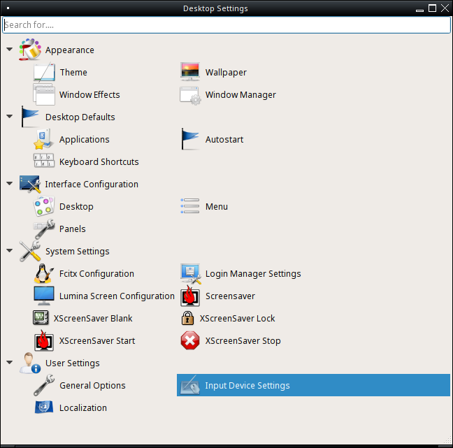
   
   : |lumina| Desktop Settings

Under the top search bar are options to configure different areas of
the system. By default, each category is expanded to provide an
efficient view of all available configuration options. Click an option
to view more details and tunables.

.. note:: If you make changes to any of the options, remember to click
   :guilabel:`Save` before exiting this utility in order to save
   them. |lumina| prompts for a decision if any unsaved changes are
   present when attempting to navigate away from the current settings
   area.

The rest of this section describes the available configurations in each
category.

.. index:: configure appearance
.. _Appearance:

Appearance
==========

This category changes the visual appearance and functionality of the
desktop on a per-screen basis.

.. index:: configure themesettings
.. _Theme Settings:

Theme Settings
--------------

The :guilabel:`Theme` option, shown in :numref:`Figure %s <lumina17>`,
is used to change the default font, font size, theme template, color
scheme, icon pack, and mouse cursors.

.. _lumina17:

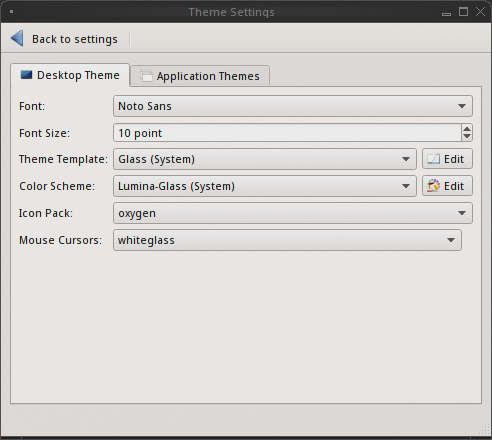

   : Desktop Theme settings

It is possible to create personalized theme templates or color schemes
by clicking :guilabel:`Edit` next to those options and changing the
settings as necessary. :numref:`Figure %s <lumina18>` shows an example
of clicking :guilabel:`Edit` on the :guilabel:`Glass (System)` theme
template. The :guilabel:`Theme Editor` opens and
the user clicks the color selector (:guilabel:`dropper` icon) in the
upper right corner. Selecting an item in this menu edits the template by
changing the values in the theme editor box.

.. note:: Theme templates are written as
   `Qt stylesheets <http://doc.qt.io/qt-5/stylesheet.html>`_. Scripting
   experience is helpful when configuring a theme.

When making changes, be sure to click :guilabel:`Save` to save the theme
without closing the editor, or click :guilabel:`Apply`, which both saves
the theme and closes the editor.

.. _lumina18:

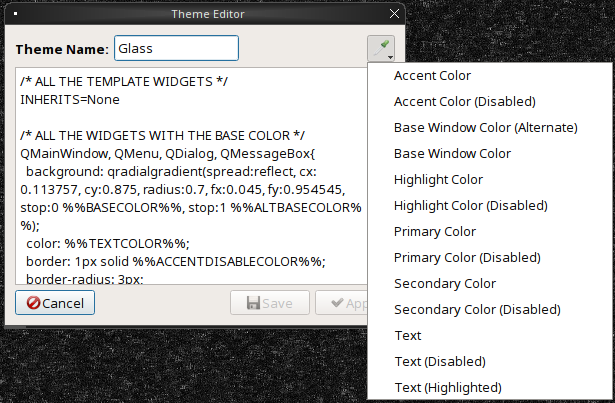

   : Using the Theme Editor

The :guilabel:`Application Themes` tab, seen in
:numref:`Figure %s <appthemes>`, allows the user to easily apply any
installed Qt5 theme engines to any Qt based applications.

.. _appthemes:

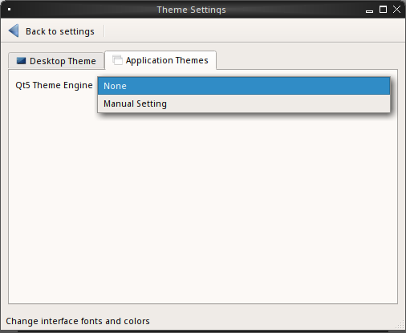
   
   : Application Themes tab, with :guilabel:`Qt5 Theme Engine` pressed.

Select the :guilabel:`Qt5 Theme Engine` drop down menu to choose between
the defaults of **None** or **Manual Setting**. Any user installed
theme engines will also appear in this drop down menu.

.. index:: appearance, wallpaper
.. _Wallpaper:

Wallpaper
---------

The :guilabel:`Wallpaper` option, shown in
:numref:`Figure %s <lumina27>`, can be used to add or remove a wallpaper
with the :guilabel:`+` or :guilabel:`-` buttons, respectively. When
:guilabel:`+` is pressed, the drop-down menu can be used to select the
file(s), a single directory, a directory and all of its subdirectories,
or a solid color to use as the wallpaper. If multiple images are
selected, :guilabel:`Rotate Background` can be selected as well as a
specified time interval in minutes to move to the next image.

.. _lumina27:

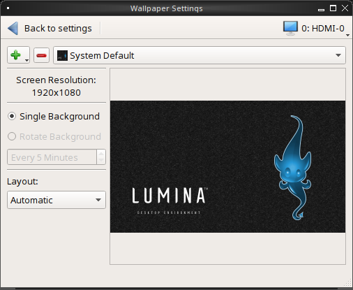
   
   : Wallpaper Settings

Click the :guilabel:`Layout` drop-down menu to change the default
layout of :guilabel:`Automatic` to one of several options:
*Fullscreen*, *Fit screen*, *Tile*, *Center*, *Top Left*, *Top Right*,
*Bottom Left*, or *Bottom Right*.

Click :menuselection:`+ --> Solid Color` to view all the wallpaper
options shown in :numref:`Figure %s <lumina16>`. Select a color and
click :guilabel:`OK` to add that color as a solid background to the
wallpaper selection drop-down menu.

.. _lumina16:

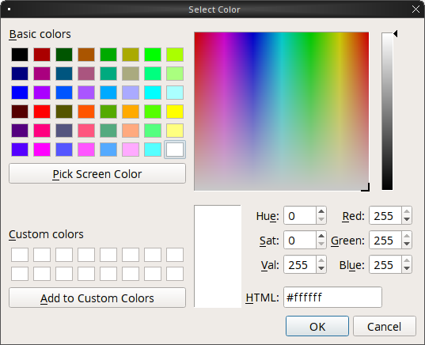

   : Custom Wallpaper colors

.. index:: window effects
.. _Window Effects:

Window Effects
--------------

:guilabel:`Window Effects`, shown in :numref:`Figure %s <lumina28>`, is
used to add or alter graphical effects or animations applied to your
windows. By default, no additional effects are added. Any desired
changes need to be adjusted manually.

.. _lumina28:

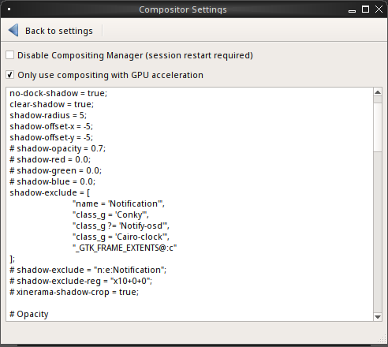

   : Window Effects

Disable the Compositing Manager by checking its associated box.
Restarting the current session is required for any changes to take
effect. By default,
:guilabel:`Only use compositing with GPU acceleration` is selected,
which improves system performance.

.. index:: window manager
.. _Window Manager:

Window Manager
--------------

:guilabel:`Window Manager`, shown in :numref:`Figure %s <lumina22>`,
contains various configuration options for the window manager.

.. _lumina22:

.. figure:: images/lumina22c.png
   :scale: 100%

   : Session Window Manager

Drop-down menus are provided for configuring all options:

* **Number of Workspaces:** A maximum of *10* workspaces can be defined,
  with a default of *2*.

* **New Window Placement:** Indicates where new windows are placed on
  the screen. Choices are *Align in a Row*, *Align in a Column*,
  *Cascade", or *Underneath Mouse*.

* **Focus Policy:** Indicates when windows receive focus. Choices are
  *Click to Focus*, *Active Mouse Focus*, or *Strict Mouse Focus*.

* **Window Theme:** Controls the appearance of the frame around
  application windows. The :guilabel:`Window Theme Preview` box previews
  the selected theme.

The :guilabel:`Advanced Editor`, seen in
:numref:`Figure %s <lumina29>`, provides options to manually adjust
every setting related to the display of windows on the system.

.. _lumina29:

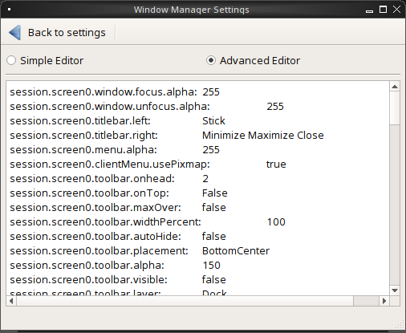

   : Window Manager - Advanced Editor

.. index:: Desktop Defaults

.. _Desktop Defaults:

Desktop Defaults
================

The :guilabel:`Desktop Defaults` category, seen in
:numref:`Figure %s <lumina3>`, is used to configure which applications
automatically start on login in to |lumina|, the default applications
and file types, and keyboard shortcuts.

.. index:: default applications
.. _Applications:

Applications
------------

Click :guilabel:`Applications` to view the default applications
:guilabel:`Basic Settings` tab, shown in :numref:`Figure %s <lumina24>`.
This tab can be used to configure default applications.

.. _lumina24:

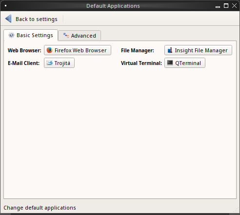

   : |lumina| Default Applications - Basic

The default *web browser*, *email client*, *file manager*, and *virtual*
*terminal* are all configurable. Click the desired application, and a new
window appears, allowing a new default application to be chosen. To
return to the default application, click the current application's name,
then :guilabel:`Restore Defaults`.

.. note:: Some applications, such as web browsers, keep their own
   internal lists of default applications for opening particular types
   of files. These applications, when configured to use the
   :command:`lumina-open` or :command:`xdg-open` utilities, refer back
   to the default applications set in :guilabel:`Applications`.

The :guilabel:`Advanced` tab allows for configuring the default
application used for particular file types, as seen in
:numref:`Figure %s <lumina7>`.

.. _lumina7:

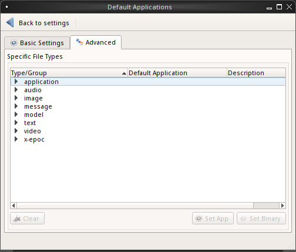

   : |lumina| Default Applications - Advanced

To add an application, select both the file type and specific group.
Then, either click :guilabel:`Set App` to open a drop-down menu of
common applications or :guilabel:`Set Binary` to open a file browser for
navigating the application path. Alternately, selecting only a file type
and clicking :guilabel:`Set App` or :guilabel:`Set Binary` registers the
application for all the groups within the selected type. Selecting
:guilabel:`Clear` removes the default application from the associated
file type or group.

.. index:: keyboard shortcuts
.. _Keyboard Shortcuts:

Keyboard Shortcuts
------------------

:guilabel:`Keyboard Shortcuts`, shown in
:numref:`Figure %s <lumina8>`, is used to configure various keyboard
shortcuts for system or window tasks. Most of these options relate to
window and workspace management, such as moving windows between
workspaces, but there are also options for changing the system audio
volume or screen brightness.

.. _lumina8:

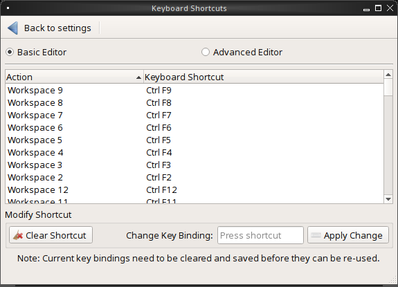

   : |lumina| Keyboard Shortcuts - Basic

To create a shortcut, click the desired entry, then
:guilabel:`Change Shortcut`, and define the desired key combination.
Any entry with an already defined shortcut showing in the
:guilabel:`Keyboard Shortcut` column can **not** be assigned to another
action. To free a shortcut for reuse, highlight the shortcut, click
:guilabel:`Clear Shortcut`, then :guilabel:`Save Changes`. A new
shortcut can now be created.

Click :guilabel:`Advanced Editor`, seen in :numref:`Figure %s <lumina30>`,
to manually adjust or create all keyboard shortcuts. By default, syntax
codes are shown in their own display area, but this can be hidden by
unchecking :guilabel:`View Syntax Codes`.

.. _lumina30:

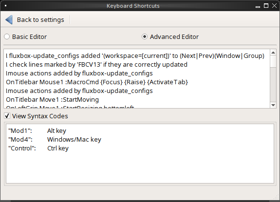

   : |lumina| Keyboard Shortcuts - Advanced

.. index:: startup
.. _Autostart:

Autostart
---------

:guilabel:`Autostart`, displayed in :numref:`Figure %s <lumina6>`,
provides adjustment options for what is automatically started when
logging into |lumina|.

.. _lumina6:

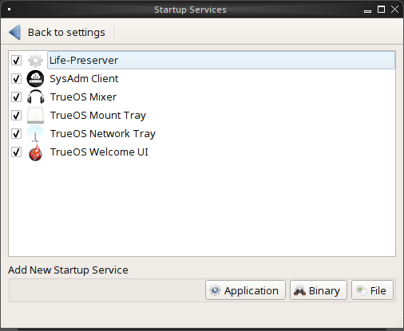

   : |lumina| Startup Services Configuration

To prevent an application from starting automatically, uncheck its box.
To add an application to the auto-start configuration , click
:guilabel:`Application` to select the application's name from a
drop-down menu. Alternately, click :guilabel:`Binary` or
:guilabel:`File` to browse to the location of the application or file to
open. If a file is chosen, |lumina| automatically opens it in an
application capable of reading the file type.

.. index:: interface configuration
.. _Interface:

Interface Configuration
=======================

:guilabel:`Interface Configuration`, as seen in
:numref:`Figure %s <lumina31>`, is used to configure the Desktop,
(right-click) Menu, and any Panels.

.. _lumina31:

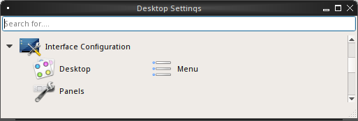

   : |lumina| Interface Configuration

.. note:: The options of :guilabel:`Menu`, :guilabel:`Desktop`, and
   :guilabel:`Panels` involve modifying and interacting with plugins.
   These are described at length in the :ref:`Plugins` chapter of this
   handbook.

.. index:: desktop config
.. _Desktop:

Desktop
-------

Select :guilabel:`Desktop` to modify the appearance of the primary
desktop and modify any embedded utilities, as seen in
:numref:`Figure %s <lumina40>`. By default, the :ref:`RSS Reader` plugin
appears in the lower right corner.

.. _lumina40:

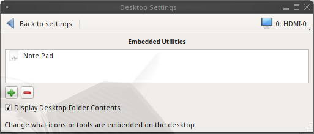
   
   : Desktop Settings

Use the :guilabel:`Plus` and :guilabel:`Minus` buttons to adjust the
embedded utilities. The :guilabel:`Display Desktop Folder Contents`
option automatically populates the Desktop with any item seen in
:file:`/<username>/Desktop`.

Right-click an icon on the desktop to view a variety of customization
options:

* **Launch Item:** Starts the item.
* **Start Moving Item:** Click the icon to lock it in place once it is
  in the desired location.
* **Start Resizing Item:** Move the mouse to resize the icon/widget.
  Click to save any changes.
* **Increase Desktop Icon Sizes:** Increases the size of all desktop
  icons, repeat as necessary.
* **Decrease Desktop Icon Sizes:** Decreases the size of all desktop
  icons, repeat as necessary.
* **Remove Item:** Removes the item from the desktop.

.. index:: right click menu
.. _rightclick menu:

Menu
----

Click :guilabel:`Menu` to adjust the appearance of the menu which
appears when right-clicking the desktop, seen in
:numref:`Figure %s <lumina36>`. By default, the context menu
includes several plugins: :ref:`Terminal`,
:ref:`Browse Files <File Manager>`, :ref:`Menu Applications`, a
:ref:`Separator`, :ref:`Settings`, and **Leave**.

.. _lumina36:

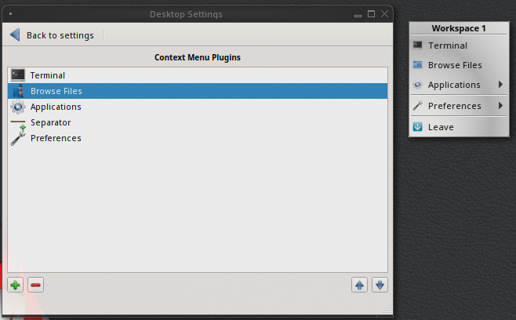
   
   : Context menu plugins configuration with an open context menu.

.. note:: :guilabel:`Leave`, with its options to *Logout*, *Restart*,
   *Shutdown*, *Lock*, and *Suspend* the system, is **always** available
   in the context menu.

.. index:: panels
.. _Panels:

Panels
------

The :guilabel:`Panels` option offers the ability to create and/or
customize panels which are attached to the edges of the screen, as seen
in :numref:`Figure %s <lumina5>`.

.. _lumina5:

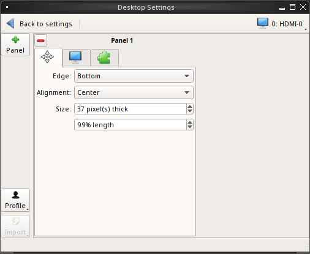

   : |lumina| Panel Configuration

This screen is used to customize the location, alignment, size, theme,
and plugins for an existing panel.
A preconfigured :guilabel:`Profile` is also available for panels. These
profiles are used to mimic the style of other desktops. Click
:guilabel:`Import` to add other custom-created profiles.

The :guilabel:`+ Panel` and :guilabel:`-` icons at the top-left of the
window can add or remove additional panels. Panels must be aligned
along a screen edge or opposite screen edges in the case of two panels.
Panels may have any width, color, or transparency.

.. note:: When adding panels, a frame similar to :guilabel:`Panel 1`
   is created for each panel, labeled :guilabel:`Panel 2`,
   :guilabel:`Panel 3`, and so on. This allows each panel to be
   configured separately. The configuration tabs available for a panel
   are described below. Be sure to select the tab in the desired panel.

The :guilabel:`Location` tab (4 arrow icon) contains a number of items:

* **Edge:** This drop-down menu is used to set the general location of
  the panel. The options are *Top*, *Bottom*, *Left*, or *Right*.

* **Alignment:** This drop-down menu is used to center the panel or pin
  it to a corner of the screen.

* **Size:** Is used to specify the panel width in pixels as well as
  panel length.

The :guilabel:`Appearance` tab (monitor icon) is shown in
:numref:`Figure %s <lumina19>`.

.. _lumina19:

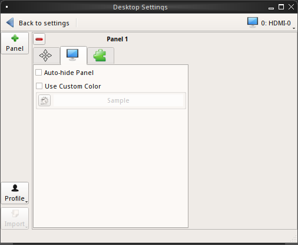

   : Panel Appearance

To hide the panel unless the mouse is hovered over it, check
:guilabel:`Auto-hide Panel`. The :guilabel:`Custom Color` option can be
used to fine-tune the panel color. Click its box, then the paint icon to
select a panel color. The panel transparency is also adjustable using
the :guilabel:`Alpha channel` element.

The :guilabel:`Plugins` tab (puzzle icon) is shown in
:numref:`Figure %s <lumina20>`.

.. _lumina20:

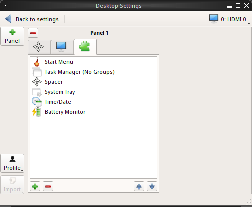

   : Panel Plugins

To add a plugin as an icon to the panel, click :guilabel:`+` below the
listed plugins and select a plugin from the list that appears. To remove
a plugin, highlight it and click :guilabel:`-`, which is below the
listed plugins. The arrow buttons can be used to move the location of
the plugin on the panel. The top of an ordered list corresponds to
either the top of a vertical panel or the left side of a horizontal
panel.

By default, |lumina| has one panel stretching across the bottom of the
primary screen and another automatically hiding panel centered at the
top of the screen.

The bottom panel incorporates the :ref:`Panel Start Menu`,
:ref:`Task Manager Plugin (No Groups)`, a :ref:`Spacer`,
:ref:`System Tray`, :ref:`Time Date`, and :ref:`Battery Monitor`
plugins.

The top panel includes the :ref:`Desktop Bar` between two
:ref:`Spacer` plugins.

.. note:: Panel and other Desktop settings may appear differently when
   using a version of |lumina| packaged with an OS. For example,
   |trueos| uses only a single panel across the bottom of the primary
   screen.

.. index:: system settings
.. _System Settings:

System Settings
===============

The :guilabel:`System Settings` category, seen in
:numref:`Figure %s <lumina41>`, displays all configurable system
utilities in one convenient location. |lumina| automatically updates
this category as new utilities are added or removed by the user or
other development updates.

.. _lumina41:

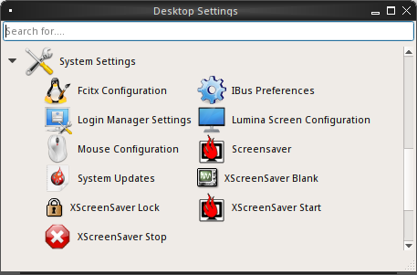

   : System Settings

The entries in this category are all symlinks. Click an entry to open
the related utility or configuration tool. For example, click
:guilabel:`Mouse Configuration` to open a simple menu for adjusting all
mouse settings.

.. TODO Contact Ken to see if there are stable entries that should be
   documented.

.. warning:: Some utilities prompt for *Root* access before opening.

.. index:: user settings
.. _User Settings:

User Settings
=============

The :guilabel:`User Settings` option governs the general settings for
the desktop session. The settings include how the time and date are
displayed, changing user icons, when to play chimes, and all
localization options.

.. index:: user settings, general options
.. _general options:

General Options
---------------

:guilabel:`General Options`, seen in :numref:`Figure %s <lumina12>`,
is used to govern numerous settings for the desktop experience.

.. _lumina12:

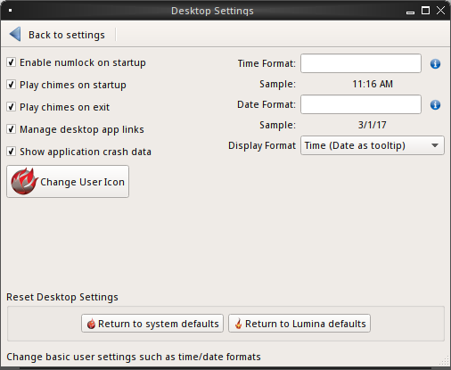

   : |lumina| General Options

Here are the options available in the General Options menu:

* **Enable numlock on startup**
* **Play chimes on startup**
* **Play chimes on exit**
* **Manage desktop app links:** When checked, |lumina| automatically
  updates the available desktop symlinks when applications are installed
  or removed.
* **Show application crash data**
* **Change User Icon**
* **Time Format**
* **Date Format**

.. note:: Click the :guilabel:`blue circle with "i" icon` for examples
   of time and date formatting.

* **Display Format:** Opens a dropdown menu for more format options.
* **Return to system defaults:** All system settings revert to those
  configured by the OS.
* **Return to Lumina defaults** All system settings revert to their
  |lumina| defaults.

.. index:: localization
.. _localization:

Localization
------------

:guilabel:`Localization` options are shown in
:numref:`Figure %s <lumina21>`.

.. _lumina21:

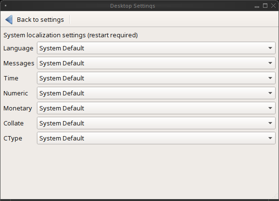

   : Session Locale Tab

The **lumina-i18n** package provides localization files. Once installed,
this allows customization of the locale used for the various items
listed in :numref:`Figure %s <lumina21>`. To install this package on a
|trueos| or FreeBSD system, type
:command:`sudo pkg install lumina-i18n`.
On other operating systems, use the default software management tool.
Since each setting has its own drop-down menu, there is flexibility to
select different locales for each item shown in this screen. If any
changes are made in the :guilabel:`Locale` tab, click
:guilabel:`Save Changes` and restart |lumina| to load the configured
locales.

Installing the **lumina-i18n** package also adds a drop-down menu to
the :guilabel:`Preferences` area of the start menu. |lumina| must be
restarted after the package installation before the locale menu is
visible in :guilabel:`Preferences`. This drop-down menu changes the
locale for the current session only. This immediately changes the
localization of any translated menu items without requiring a restart
of |lumina|.

.. note:: If using |lumina| with a language other than English, any menu
          items that continue to be displayed in English have not yet
          been translated to the selected language. To assist the
          |lumina| Project with translating menu items, see
          :ref:`Interface Translation`.
