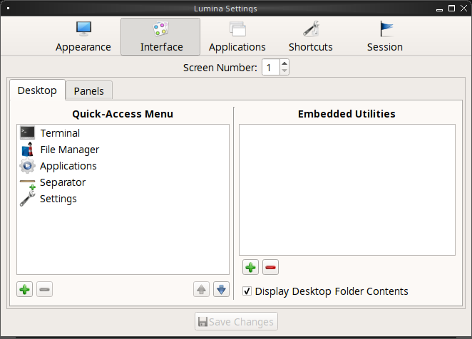

.. index:: configuration

.. _Lumina Configuration:

Lumina Configuration
********************

The Lumina Configuration utility, shown in 
:numref:`Figure %s: Lumina Desktop Configuration <lumina3c>`, can be 
used to configure every aspect of the desktop and is the recommended way
to make changes. To launch this utility, click the start menu then 
:menuselection:`Preferences --> Configure Desktop`, right-click the 
desktop and click :menuselection:`Preferences --> Desktop`, or type 
:command:`lumina-config` from an xterm.

.. _lumina3c:

.. figure:: images/lumina3c.png
   :width: 662px
   :height: 476px
   :scale: 100%
   
Each of the tabs at the top configures a different area of the system, 
with the most frequently changed options on the left side. As changes 
are made, the "Save Changes" button at the bottom of the window becomes 
active. This allows the user to setup multiple changes in any tab and 
apply them all at the same time.

.. note:: If you make any changes in any of the tabs, remember to click 
          "Save Changes" before exiting this utility in order to save 
          them.

The rest of this section describes the configurations that are available
in each tab. 

.. index:: appearance, wallpaper
.. _Appearance:

Appearance
==========

This tab is used to change the visual appearance and functionality of 
the desktop on a per-screen basis. The "Wallpaper" tab, shown in
:numref:`Figure %s: Lumina Desktop Configuration <lumina3c>`, can be 
used to add a wallpaper ("+" button) or remove ("-" button) a wallpaper.
When you click the "+" button, the drop-down menu can be used to select 
the file(s), a single directory, a directory and all of its 
subdirectories, or a solid color to use as the wallpaper. If multiple 
images are selected, the "Rotate Background" button can be selected as 
well as a specified time interval in minutes to rotate to the next 
image. 
   
Click the "Layout" drop-down menu to change the default layout of 
"Automatic" to one of the following options: "Tile", "Center", 
"Top Left", "Top Right", "Bottom Left", or "Bottom Right".

The options that are available when you click 
:menuselection:`+ --> Solid Color` are shown in 
:numref:`Figure %s: Modifying the Wallpaper <lumina16b>`. If you select 
a color and click "OK", it will be added as a solid color background to 
the wallpaper selection drop-down menu.

.. _lumina16b:

.. figure:: images/lumina16b.png
   :width: 537px
   :height: 436px
   :scale: 100%

The "Theme" tab, shown in :numref:`Figure %s: Modifying the Theme <lumina17c>`,
can be used to change the default font, font size, theme template, color
scheme, icon pack, and mouse cursors. 

.. _lumina17c:

.. figure:: images/lumina17c.png
   :width: 662px
   :height: 476px
   :scale: 100%
   
It is possible to create your own "Theme Template" or "Color Scheme" by 
clicking the "Edit" button next to those options and changing the 
settings as necessary. :numref:`Figure %s: Using the Theme Editor <lumina18b>`
shows an example of clicking the "Edit" button with the "Lumina-default 
(System)" theme template selected. This action opened the "Theme Editor"
and the user has clicked the color selector (dropper icon) in the upper 
right corner. After selecting an item in this menu, the template 
controlling that selection can be edited by changing the values in the 
theme editor box. Note that the theme templates are written as 
`Qt stylesheets <http://doc.qt.io/qt-5/stylesheet.html>`_, so some 
scripting experience may be helpful when configuring a theme. After 
making your changes, you can either click the "Save" button to save the 
theme without closing the editor, or click the "Apply" button which will
both save the theme and close the theme editor.

.. _lumina18b:

.. figure:: images/lumina18b.png
   :width: 871px
   :height: 465px
   :scale: 100%

.. index:: menu, panel

.. _Interface:

Interface
=========

The "Interface" tab is used to configure the desktop right-click menu 
and panel. Its "Desktop" tab, shown in :numref:`Figure %s: Right-Click Menu Configuration <lumina4d>`,
is used to configure which items appear in the right-click menu and 
which items are embedded onto the desktop.

.. _lumina4d:

To add an item to the right-click menu, click the "+" button under the 
"Quick-Access Menu". This will open the "Select a Plugin" screen where 
you can add an application, custom app, an entry for the :ref:`Insight File Manager`,
a separator, a shortcut to Settings, a terminal, or a listing of 
currently open applications. To remove an item from the right-click 
menu, highlight it and click the "-" button. Use the arrow buttons to 
change the order of the items in the right-click menu.

To embed a utility onto the desktop, click the "+" button under the 
"Embedded Utilities" frame. The following plugins can be added as an 
icon on the desktop: Application Launcher (opens a menu that lists which
applications can be launched), Audio Player, Calendar, Desktop Icons 
View, Note Pad, Sample (an example of a QtQuick/QML plugin), and System 
Monitor (displays CPU temperature/usage, memory usage, and disk I/O). 
Once you click the "Save Changes" button, any utilities you added will 
appear on top of the desktop. To remove an embedded utility from the 
desktop, highlight its entry under "Embedded Utilities", click the "-" 
button, and click "Save Changes". Alternately, right-click the icon for 
the utility and select "Remove Item" from the right-click menu. 

The following options are also available when you right-click an icon on
the desktop, allowing you to customize the location and appearance of 
desktop icons: "Start Moving Item" (click the icon to lock it in place 
once you have moved it to the desired location), "Start Resizing Item" 
(use the mouse to increase/decrease size and click when you are 
finished), "Increase Desktop Icon Sizes" (increases all desktop icons, 
repeat as necessary), and "Decrease Desktop Icon Sizes" (decreases all 
desktop icons, repeat as necessary).

The "Display Desktop Folder Contents" option is used to display each 
item stored in :file:`~/Desktop` as an icon on the desktop. By default, 
this option is selected as its box is black. If you de-select this 
option and click "Save Changes", the icons for the contents of 
:file:`~/Desktop` will be removed from the desktop.
   
To configure the panel, click the "Panels" tab which will open the 
screen shown in :numref:`Figure %s: Panels Tab <lumina5e>`.

.. _lumina5e:

.. figure:: images/lumina5e.png
   :width: 662px
   :height: 476px
   :scale: 100%

This screen can be used to customize the location, alignment, size, 
theme, and plugins for an existing panel. The "+" and "-" icons towards 
the top, next to "Panel 1" can be used to add or remove additional 
panels. Panels must be aligned along a screen edge, opposite screen 
edges in the case of two panels, and may have any width, color, or 
transparency. 

.. note:: If you add additional panels, a frame, similar to "Panel 1", 
          will be created for each panel, and will be labeled "Panel 2",
          "Panel 3", and so on. This allows you to configure each panel 
          separately. The configuration tabs available for a panel are 
          described below. Be sure to select the tab in the panel that 
          you wish to customize.

The "Location" tab (4 arrow icon) contains the following items:

* **Edge:** this drop-down menu can be used to set the location of the 
  panel which can be "Top", "Bottom", "Left", or "Right". 

* **Alignment:** this drop-down menu can be used to center the panel on 
  the edge or pin it to one of the corners. 

* **Size:** can be used to specify the panel width in pixels and the 
  panel length. 

The "Appearance" tab (monitor icon) is shown in 
:numref:`Figure %s: Panels Appearance Tab <lumina19c>`.

.. _lumina19c:

.. figure:: images/lumina19c.png
   :width: 662px
   :height: 476px
   :scale: 100%

If you would like the panel to be hidden unless the mouse is hovered 
over it, check the "Auto-hide Panel" box. The "Custom Color" option can 
be used to fine-tune the panel color. Click its box, then the paint icon
to select the panel color.

The "Plugins" tab (puzzle icon) is shown in :numref:`Figure %s: Panels Plugins Tab <lumina20c>`.

.. _lumina20c:

.. figure:: images/lumina20c.png
   :width: 662px
   :height: 476px
   :scale: 100%

To add a plugin as an icon to the panel, click the "+" button below the 
listed plugins and select a plugin from the list that appears. The 
available plugins include:

* **Application Launcher:** when you select this plugin, it will prompt 
  you to select the application to launch. This will add a shortcut for 
  launching the selected application to the panel.
  
* **Application Menu:** adds an application menu that contains a 
  shortcut to your home directory, a shortcut to the operating system's 
  graphical software management utility (if there is one), a shortcut to
  the operating system's Control Panel (if it provides one), and a list 
  of installed software sorted by categories.

* **Battery Monitor:** hover over this icon to view the current charge 
  status of the battery. When the charge reaches 15% or below, the low 
  battery icon will flash intermittently and will change to a low 
  battery icon when there is less than 5% charge left.

* **Desktop Bar:** adds a "star" button for automatically displaying 
  entries for anything in the :file:`~/Desktop` folder and alternately 
  launching the selected entry.

* **Line:** adds a separator line to the panel.

* **Show Desktop:** this button will hide all open windows so that only 
  the desktop is visible. This is useful for touch screens or small 
  devices.

* **Spacer:** adds a blank area to the panel.

* **Start Menu:** adds a classic start menu as seen on other operating 
  systems.

* **System Dashboard:** used to view/modify audio volume, screen 
  brightness, battery life, and virtual desktops.

* **System Tray:** provides a display area for dockable applications.

* **Task Manager (No Groups):** ensures that every window gets its own 
  button. This uses a lot more space on the panel since it needs to put 
  part of the window title on each button.
  
* **Task Manager:** is added by default. Its behavior is to group 
  windows by application.

* **Time/Date:** displays the current time and date.

* **User Button:** main button for accessing applications, directories, 
  settings, and log out.

* **Workspace Switcher:** used to switch between virtual desktops.

To remove a plugin, highlight it and click the "-" button below the 
listed plugins. The arrow buttons can be used to move the location of 
the plugin on the panel. The top of an ordered list corresponds to 
either the top of a vertical panel or the left side of a horizontal 
panel. 

.. index:: application startup
.. _Applications:

Applications
============

The "Applications" tab, shown in :numref:`Figure %s: Lumina Applications Configuration <lumina6c>`,
is used to configure which applications start when you login to Lumina 
as well as the default applications and file types.

.. _lumina6c:

.. figure:: images/lumina6c.png
   :width: 662px
   :height: 476px
   :scale: 100%
   
To prevent an application from starting automatically, uncheck its box.

To add an application to the auto-start configuration , click 
"Application" to select the application's name from a drop-down menu or 
click "Binary" or "File" to browse to the location of  the application 
or file to open. If you select a file name, Lumina will automatically 
open it in an application that is capable of reading the file type.

To configure the default application used for particular file types, 
click the "File Defaults" tab, shown in :numref:`Figure %s: Lumina Defaults Configuration <lumina7d>`. 

.. _lumina7d:

.. figure:: images/lumina7d.png
   :width: 662px
   :height: 476px
   :scale: 100%
   
To add an application, select the file type and specific group and 
either click "Set App", which will open a drop-down menu of common 
applications, or "Set Binary", which will open a file browser so that 
you can browse to the path of the application. Alternately, selecting 
only a file type and then clicking "Set App" or "Set Binary" will 
register your application for all the groups within the selected type.

The "Common Applications" tab, shown in :numref:`Figure %s: Lumina Common Applications Configuration <lumina24>`,
can be used to configure default applications.

.. _lumina24:

.. figure:: images/lumina24.png
   :width: 662px
   :height: 476px
   :scale: 100%

You can configure the default web browser, email client, file manager, 
and virtual terminal. Simply click the application you wish to change, 
and a new window will appear allowing you to select a new default 
application. If you wish to go back to the default application, click 
the current application's name, then click "Restore Defaults".

.. note:: Some applications, such as web browsers, keep their own 
          internal lists of default applications for opening particular 
          types of files. If you set that application to use the 
          :command:`lumina-open` or :command:`xdg-open` utilities, it 
          will use the default applications that are set here so that 
          there is only a single list of default applications for the 
          system.

.. index:: shortcuts
.. _Shortcuts:

Shortcuts
=========
  
The "Shortcuts" tab, shown in :numref:`Figure %s: Lumina Shortcuts Configuration <lumina8b>`,
is used to configure various keyboard shortcuts for system or window 
tasks. Most of these options relate to window and workspace management, 
such as moving windows between workspaces, but there are also options 
for changing the system audio volume or screen brightness. 

.. _lumina8b:

.. figure:: images/lumina8b.png
   :width: 662px
   :height: 476px
   :scale: 100%
      
To create a shortcut, click the desired entry, then "Change Shortcut", 
then the key combination you wish to set. Note that any entry that 
already has a defined shortcut showing in the "Keyboard Shortcut" column
can **not** be assigned to another action. First, highlight that 
shortcut, click "Clear Shortcut", then "Save Changes". You can now 
create a new shortcut.

.. index:: session
.. _Session:

Session
=======

The "Session" tab, shown in :numref:`Figure %s: Session General Options Tab <lumina12e>`,
governs the general settings for the desktop session. These settings are
usually not changed on a frequent basis.

.. _lumina12e:

.. figure:: images/lumina12e.png
   :width: 662px
   :height: 476px
   :scale: 100%

The "General Options" tab can be used to automatically enable numlock, 
to play chimes when Lumina starts or exits, and to change the icon that 
appears  in the login menu and the start menu button. It also has 
options to set the time format, date format, and time display format. 
Buttons are available to reset these options to either the system 
defaults or Lumina defaults.

The "Locale" tab is shown in :numref:`Figure %s: Session Locale Tab <lumina21b>`.

.. _lumina21b:

.. figure:: images/lumina21b.png
   :width: 662px
   :height: 476px
   :scale: 100%

The lumina-i18n package provides localization files. Once installed, 
this allows you to customize which locale is used for the various items 
listed in :numref:`Figure %s: Session Locale Tab <lumina21b>`. To 
install this package on a PC-BSD or FreeBSD system, use 
:command:`sudo pkg install lumina-i18n`. On other operating systems, use
the software management tool that comes with the operating system. If 
the Lumina Configuration utility was open before the installation, 
restart it so that the list of localizations can be loaded into the 
drop-down menus of this screen. Since each setting has its own drop-down
menu, you have the flexibility to select different locales for each item
shown in this screen. Note that if you make any changes in the "Locale" 
tab, click the "Save Changes" button and restart Lumina so the 
configured locales can be loaded.

Installing the lumina-i18n package will also add a drop-down menu to the
"Preferences" of the start menu, though you will need to restart Lumina 
after the package installation in order for the locale menu to appear in
"Preferences". This drop-down menu can be used to temporarily change the
locale for this session only. This will immediately change the 
localization of any translated menu items on the fly so that you do not 
have to log back into the Lumina session.

.. note:: Any menu items that continue to be displayed in English have 
          not been translated to the selected language yet. You can 
          assist the Lumina Project in translating menu items using the
          instructions in :ref:`Interface Translation`.

The "Window System" tab, shown in :numref:`Figure %s: Session Window System Tab <lumina22b>`,
contains various configuration options for the window manager. 

.. _lumina22b:

.. figure:: images/lumina22b.png
   :width: 662px
   :height: 476px
   :scale: 100%
   
Drop-down menus are provided for configuring the following:

* **Number of Workspaces:** up to *10* workspaces can be defined, with a
  default of *2*.

* **New Window Placement:** indicates where new windows are placed on 
  the screen. Choices are "Align in a Row", "Align in a Column", 
  "Cascade", or "Underneath Mouse".

* **Focus Policy:** indicates when windows receive focus. Choices are 
  "Click to Focus", "Active Mouse Focus", or "Strict Mouse Focus".

* **Window Theme:** controls the appearance of the frame around 
  application windows. The "Window Theme Preview" screen can be used to 
  preview the selected theme.