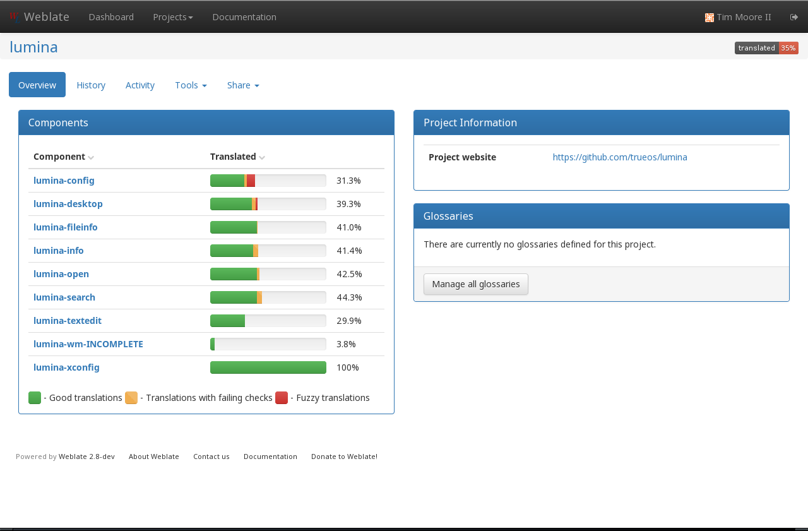
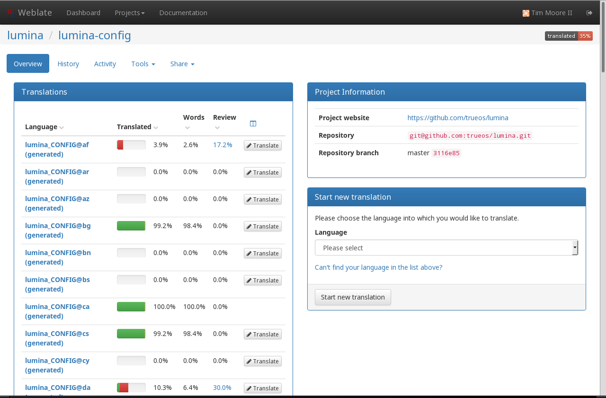
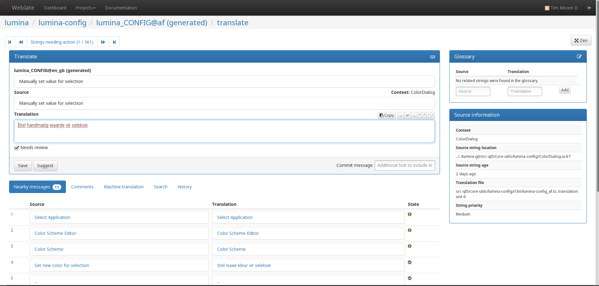

.. _Contribute!:

Contribute!
***********

|lumina| is an open source project which relies on involvement from its
users and supporters to assist in development, documentation, and
localization. This section describes how to best assist the |lumina|
Project.

.. _communicate:

Communicate
===========

Communication is the lifeblood of any open source project, and |lumina|
is no exception. The developers have attempted to create many
communication options in order to present a wide variety of options for
users to collaborate and contribute to the project:

.. note:: Due to the closeness of the two projects, |lumina| and
   |trueos| share many of these communication channels. If using a
   shared channel, please clarify which project you are discussing.

* **Forums:** A `Lumina <https://forums.pcbsd.org/forum-26.html>`_
  section is available on the |pcbsd| forums. Registration is required
  before creating a new thread.

* **GitHub:** The
  `Lumina GitHub repository <https://github.com/trueos/lumina>`_ has
  an "Issues" section for :ref:`Report a Bug` or requesting features.
  If requesting a feature, be sure the title of the issue begins with
  **Feature Request:**.

* **Telegram:** `Telegram <https://telegram.org/>`_ is a messaging
  application the TrueOS project uses to communicate. Discussions or
  questions about |lumina| are welcome in the :literal:`TrueOS Community`
  channel.

* **IRC:** The #pcbsd or #lumina-desktop channels on the Freenode IRC
  server are also available for collaborating with other users and the
  developers.

* **Mailing Lists:** Visit http://lists.pcbsd.org/mailman/listinfo to
  view the various mailing list options. Click an option to open a page
  that allows you to subscribe to the list.

* **Reddit:** The |trueos|
  `Subreddit page <https://www.reddit.com/r/TrueOS/>`_ is available for
  general discussion of the |lumina| or |trueos| projects. An account is
  not necessary to view topics, but is required to create new posts.

* **Weblate:** |lumina| uses Weblate, an online translation tool, to
  translate and provide |lumina| in a variety of languages. See
  :ref:`Become a Translator` for details about translating |lumina|.

* **Website:** The `Lumina Website <https://lumina-desktop.org/>`_
  offers the latest news and updates about the project.

The |lumina| developers want your feedback about how to improve the
project. Please use these communication options and let us know what you
think!

.. _Report a Bug:

Report a Bug
============

One of the most effective ways to assist the |lumina| Project is by
reporting problems or bugs encountered while using |lumina|. Subscribing
to `Lumina News <https://lumina-desktop.org/news/>`_ is a
good way to keep up-to-date on the availability of new |lumina|
versions.

Anyone can report a |lumina| bug. However, bug reporting should follow a
few guidelines to ensure a speedy response:

* |lumina| uses its
  `GitHub repository <https://github.com/trueos/lumina>`_,
  seen in :numref:`Figure %s <buga>`, to manage bugs. A GitHub account
  is required before bugs can be reported. Navigate to
  https://github.com, fill in the required fields, and click
  :guilabel:`Sign up for GitHub` to create a new github account.

.. _buga:

.. figure:: images/buga.png
   :scale: 100%

   Lumina Issues Tracker

.. warning:: The GitHub issues tracker uses email to update contributors
   on the status of bugs. Please use a valid and frequently used email
   address when creating a GitHub account for the efficient resolution
   of issues.

* Use the :guilabel:`Search` bar on the
  `Issues` <https://github.com/trueos/lumina/issues>`_
  section to confirm no similar bug report exists. If a similar report
  does exist, add any additional information to the report via a
  comment. While it is not required to log in to search existing bugs,
  adding a comment or creating a new report does require signing into
  the website.

* To create a new bug report, log into the website, then navigate to
  `<https://github.com/trueos/lumina/issues>`_. Click
  :guilabel:`New Issue` to open the window shown in
  :numref:`Figure %s <bug1>`.

.. _bug1:

.. figure:: images/bug1.png
   :scale: 100%

   Creating a Bug Report

* Write a brief but descriptive title that includes the error and
  the version of |lumina|. Ideally, the title is short (8 words or less)
  and contains key words about the error so the bug report is easily
  found with the search tool.

* In the :guilabel:`Description` field, write about the circumstances of
  the error, including instructions how to recreate it. If an error
  message is generated, reproduce the error in its entirety. Also,
  attaching a screenshot to the report can greatly aid the developer in
  visualizing the problem.

* After describing the issue, click :guilabel:`Submit new issue` to
  create the issue. The bug tracker will attach a unique number to the
  report and send update messages to the creator's registered email
  address whenever activity occurs with the bug report.

.. _Become a Translator:

Become a Translator
===================

Translating |lumina| into additional languages is extremely helpful to
the developers, and very appreciated! There are two primary elements to
|lumina| which need to be translated:

1. The graphical elements within |lumina|.

2. The |lumina| Handbook (this document).

This section describes each of these elements in more detail and how to
begin participating in translating Lumina.

An excellent first step is to join the translations
`mailing list <http://lists.pcbsd.org/mailman/listinfo/translations>`_.
After joining, send an introductory email and indicate which language(s)
and which type(s) of translations you can assist with. Participating in
the mailing list will keep you up to date with important changes to
|lumina| and help coordinate with the other volunteers.

.. index:: interface translations
.. _Interface Translation:

Interface Translation
---------------------

|lumina| uses `Weblate <http://weblate.trueos.org/projects/lumina/>`_ to
manage the localization of menu screens seen in |lumina|. Weblate also
efficiently displays the progress of localization efforts, allowing
users to quickly find if their language is fully or partially supported
in |lumina|. Furthermore, Weblate simplifies the process to check and
submit translated text through its integrated web editor and commenting
system. These tools allow translators to spend more of their time making
and reviewing translations rather than learning how to use a complicated
tool set.

To see the status of a localization, open the
`Lumina Weblate Project <http://weblate.trueos.org/projects/lumina/>`_
in a web browser, as seen in :numref:`Figure %s <translate1b>`.

.. _translate1b:

   The |lumina| Project Overview Screen.

Requested localizations are listed alphabetically on the left. The right
columns contain information about the project and any glossaries that
may be defined for the project. If the desired language is missing and
you would like to help in its translation, notify the |lumina| or
|trueos| developers on Slack, Gitter, or Reddit.

The green bar in the :guilabel:`Translated` column indicates the
completion percentage of the various |lumina| components. Green progress
shows good translations, while yellow and red colors in the progress bar
indicate translations that may need additional review. Any language not
fully translated will display the incomplete menus in English.

Click on a component name to see each available language for
translation. :numref:`Figure %s <translate2b>` shows the *lumina-config*
component. In this example, **lumina-config** is almost completely
translated to Bulgarian (bg), but has just begun translation to
Afrikaans (af).

.. _translate2b:

   lumina-config Overview screen.

A Weblate account is necessary to edit a translation. Log in to Weblate
and navigate to the desired component in need of translation. In
:numref:`Figure %s <translate3b>`, the translator has clicked
:guilabel:`Translate` in the :guilabel:`lumina_CONFIG@af` row.

.. _translate3b:

   Translation screen for lumina-config, Afrikaans language

In this example, the phrase "Manually set value for selection" needs to
be reviewed. To edit the translation, type the translated text into the
:guilabel:`Translation` text field and click :guilabel:`Save` or
:guilabel:`Suggest`. There is also a :guilabel:`Commit message` field
for adding a comment to the translation. To translate or review another
string, press the :guilabel:`forward` or :guilabel:`back` icons at the
top of the page. Additionally, Weblate generates a
:guilabel:`Nearby messages` section across the bottom of the page,
providing quick links to other strings needing review. On the right side
of the page are several boxes providing additional information:

* **Things to check:** Weblate will generate warnings about elements of
  the string that may need review. This box will only appear if the
  automatic reviewer generates an error.

* **Glossary:** The glossary box can provide simple lookups to aid in
  translating a string, but a glossary will need to be added to the
  project first.

* **Source information:** This box offers background information on the
  string: the context, location, its priority, and if it fails any of
  the Weblate checks.

If help is needed with a translation or general use of the Weblate
system, please ask for help on the translations mailing list or in the
`translations forum <https://forums.pcbsd.org/forum-40.html>`_.

.. index:: translations
.. _Documentation Translation:

Documentation Translation
-------------------------

At this time, the |lumina| Handbook has not yet been added to the
translation system. Once it has, instructions for translating the
Handbook will be added here.

.. _Become a Developer:

Become a Developer
==================

Developers who want to help improve the |lumina| codebase are always
welcome! To participate in core development, please subscribe to the
`developers mailing list <http://lists.pcbsd.org/mailman/listinfo/dev>`_.

All |lumina| utilities are developed with C++ using Qt Libraries, but
other Qt-based languages are used in the project too. For example, the
CSS-like
`Qt Stylesheet language <http://doc.qt.io/qt-4.8/stylesheet.html>`_ is
used for theme templates.

.. index:: development
.. _Getting the Source Code:

Getting the Source Code
-----------------------

|lumina| uses `github <https://github.com/trueos/lumina>`_ to store its
source code.

.. note:: Be sure :command:`git` in installed on your system prior to
   downloading the source code. |trueos| includes :command:`git` as part
   of the base install.

To download the source code, use the command line to navigate to (or
create) the desired storage directory and from within the directory,
type:

.. code-block:: none

    git clone git://github.com/trueos/lumina.git

These commands will create a directory named :file:`lumina/`, which
contains the local copy of the repository. Keep the local copy
synchronized with the official repository by typing :command:`git pull`
within the :file:`lumina/` directory.

To compile the source code, start by checking the list of
`required software <https://github.com/trueos/lumina/blob/master/DEPENDENCIES>`_
to install any needed Qt5 modules. Alternately,
:command:`pkg install qt5` installs all available Qt5 modules, which
ensures the system can compile the source code.

.. note:: The :command:`pkg` system is used by FreeBSD based operating
   systems; other OS's will use different packaging systems and command
   syntax.

Once the necessary Qt elements are installed, compile the source by
typing :command:`qmake` to generate a :file:`Makefile`, then run
:command:`make`. This example is using a |trueos| system; the binary
paths may differ on other operating systems:

.. code-block:: none

    cd lumina

    /usr/local/lib/qt5/bin/qmake

    make

.. note:: If you encounter an issue trying to compile the source on a
   system other than |trueos|, refer to the "How to build from source"
   section of the
   `README <https://github.com/trueos/lumina/blob/master/README.md>`_
   for additional instructions.

To also install the compiled applications, type
:samp:`% sudo make install`. This command requires superuser privileges.

Several Qt integrated development environments (IDE) are available for
development. These IDEs can be installed using |appcafe| on |trueos| or
other operating systems' software management utilities.
`QtCreator <http://wiki.qt.io/Category:Tools::QtCreator>`_ is a fully
featured IDE designed to help new Qt developers acclimate quickly and
boost the productivity of experienced developers.
`Qt Designer <http://doc.qt.io/qt-4.8/designer-manual.html>`_ is a
lighter weight option as it includes only a :file:`.ui` file editor with
no other IDE functionality.

To submit changes for inclusion in |lumina|, fork the
`repository <https://github.com/trueos/lumina>`_
using the instructions in
`fork a repo <https://help.github.com/articles/fork-a-repo>`_.
Make any changes to the forked repository, them submit them for
inclusion in the primary |lumina| repository via a git
`pull request <https://help.github.com/articles/using-pull-requests>`_.
Once the submitted changes are reviewed, they can either be committed to
the repository or returned to the creator with additional suggestions
for improvement.

.. index:: development
.. _Design Guidelines:

Design Guidelines
-----------------

|lumina| is a project driven by the support of developers within the
community. Developers have designed and implemented a number of new
utilities and tools into Lumina since its inception. The project aims to
present a unified design in order to retain the familiarity of most
programs. For example, while programs have had the titles of "File",
"Main", or "System" as the first entry in a menu bar, |lumina| opts to
use "File", as it is the most common option for the first category on a
menu bar.

The
`Developer Guidelines <https://github.com/trueos/lumina/blob/5beb2730a9e8230d2377ea89e9728504ea88de9c/DeveloperGuidelines.txt>`_
contain some coding practices for creating effective updates or
utilities. For menu and program design in |lumina|, there is a small
list of guidelines volunteer developers are encouraged to follow.

Any graphical program which is a fully featured utility, such as
:ref:`Insight File Manager`,  needs a "File" menu. However, a "File"
menu is not necessary for a small widget or dialogue box. When making a
file menu, try to keep it very simple. Most |lumina| utilities include
only two or three items in the "File" menu.

"Configure" is the |lumina| standard for the category of settings or
configuration related settings. If additional categories are needed, it
is recommended to look through other |lumina| utilities for common
naming conventions.

File menu icons are taken from the installed icon theme.

|lumina| utilities uses several buttons:

* **Apply:** Applies settings and leaves the window open.

* **Close:** Closes a program without applying settings.

* **OK:** Closes the dialogue window and saves settings.

* **Cancel:** Closes the dialog window without applying settings.

* **Save:** Saves settings and can also close the window.

Keyboard shortcuts are extremely useful to many users, and |lumina|
attempts to include shortcuts in every utility. Qt simplifies assigning
keyboard shortcuts. For example, configuring keyboard shortcuts to
browse the "File" menu is as simple as adding :command:`&File` to the
menu entry's text field during application creation. Whichever letter
has the *&* symbol in front will become the new hotkey. A shortcut key
can also be made by clicking the menu or submenu entry and assigning a
shortcut key. Avoid creating duplicate hotkeys or shortcuts. Every entry
in a menu or submenu should have a key assigned for accessibility.
:numref:`Table %s <shkeys>` and :numref:`Table %s <hokeys>` summarize
the commonly used shortcut and hotkeys.

.. tabularcolumns:: |>{\RaggedRight}p{\dimexpr 0.60\linewidth-2\tabcolsep}
                    |>{\RaggedRight}p{\dimexpr 0.40\linewidth-2\tabcolsep}|

.. _shkeys:

.. table:: Shortcut Keys
   :class: longtable

   +---------------+---------+
   | Shortcut Key  | Action  |
   +===============+=========+
   | CTRL + Q      | Quit    |
   +---------------+---------+
   | F1            | Help    |
   +---------------+---------+

.. tabularcolumns:: |>{\RaggedRight}p{\dimexpr 0.50\linewidth-2\tabcolsep}
                    |>{\RaggedRight}p{\dimexpr 0.50\linewidth-2\tabcolsep}|

.. _hokeys:

.. table:: Hot Keys
   :class: longtable

   +-----------+-----------------+
   | Hot Key   | Action          |
   +===========+=================+
   | Alt + Q   | Quit            |
   +-----------+-----------------+
   | Alt + S   | Settings        |
   +-----------+-----------------+
   | Alt + I   | Import          |
   +-----------+-----------------+
   | Alt + E   | Export          |
   +-----------+-----------------+
   | ALT + F   | File Menu       |
   +-----------+-----------------+
   | ALT + C   | Configure Menu  |
   +-----------+-----------------+
   | ALT + H   | Help Menu       |
   +-----------+-----------------+

Developers may also find these resources helpful:

* `Commits Mailing List <http://lists.pcbsd.org/mailman/listinfo/commits>`_

* `Qt 5.4 Documentation <http://doc.qt.io/qt-5/index.html>`_

* `C++ Tutorials <http://www.cplusplus.com/doc/tutorial/>`_
