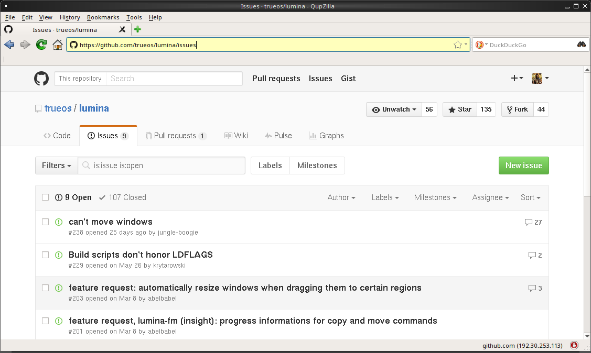
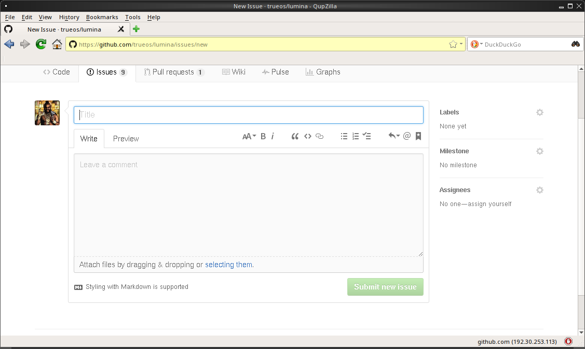
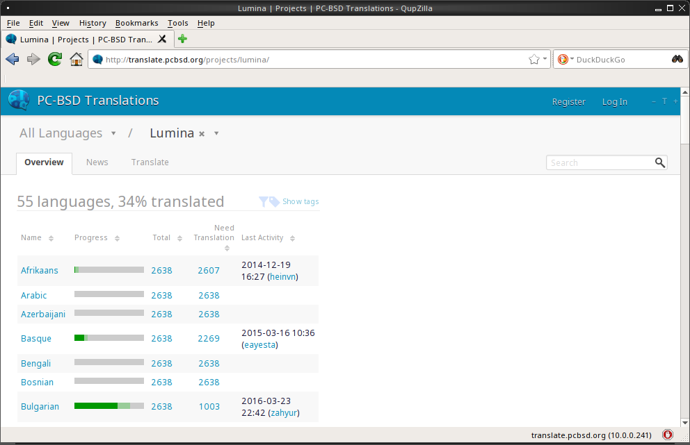
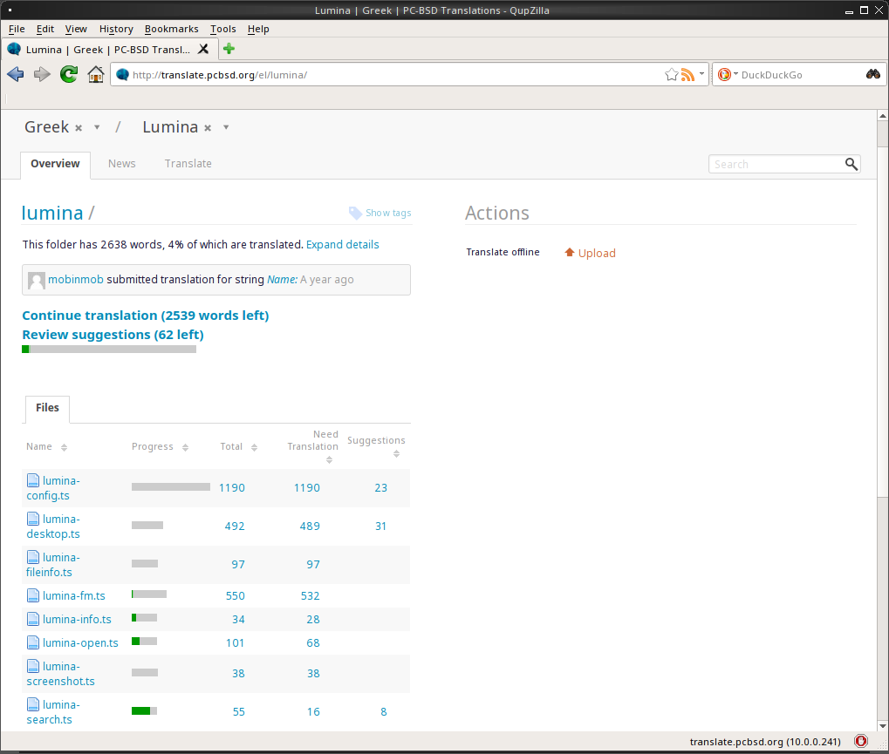
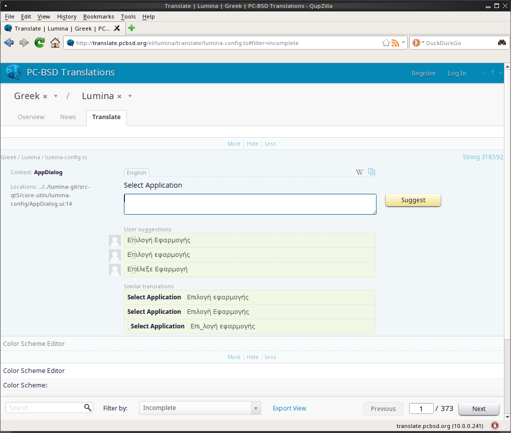

.. _Contributing to Lumina:

Contributing to Lumina
**********************

Lumina is an open source project which relies on involvement from its
users and supporters to assist in development, documentation, and
localization. This section describes how to best assist the Lumina
Project.

.. _Report a Bug:

Report a Bug
============
  
One of the most effective ways to assist the Lumina Project is by
reporting problems or bugs encountered while using Lumina. Subscribing
to `Lumina News <https://lumina-desktop.org/news/>`_ is a
good way to keep up-to-date on the availability of new Lumina versions.

Anyone can report a Lumina bug. However, bug reporting should follow a
few guidelines to ensure a speedy response:

* Lumina uses its `GitHub repository <https://github.com/trueos/lumina>`_,
  seen in :numref:`Figure %s: Lumina Issues Tracker <buga>`, to manage
  bugs. A GitHub account is required before bugs can be reported.
  Navigate to https://github.com, fill in the required fields, and click
  :guilabel:`Sign up for GitHub` to create a new github account.

.. _buga:

.. important:: The GitHub issues tracker uses email to update
   contributors on the status of bugs. Please use a valid and frequently
   used email address when creating a GitHub account for the efficient
   resolution of issues.

* Use the "Search" bar on the `"Issues"` <https://github.com/trueos/lumina/issues>`_
  page to confirm no similar bug report exists. If a similar report does
  exist, add any additional information to the report via a comment.
  While it is not required to log in to search existing bugs, adding a
  comment or creating a new report does require signing into the
  website.

* To create a new bug report, log into the website, then navigate to
  `<https://github.com/trueos/lumina/issues>`_. Click :guilabel:`New Issue`
  to open the window shown in :numref:`Figure %s: Creating a Bug Report <bug1>`.

.. _bug1:

* Write a brief but descriptive "Title" that includes the error and
  the version of Lumina. Ideally, the title is short (8 words or less)
  and contains key words about the error so the bug report is easily
  found with the search tool.

* In the "Description" field, write about the circumstance of the error,
  including instructions how to recreate it. If an error message is
  generated, reproduce the error in its entirety. Also, attaching a
  screenshot to the report can greatly aid the developer in visualizing
  the problem.

* After describing the issue, click :guilabel:`Submit new issue` to
  create the issue. The bug tracker will attach a unique number to the
  report and send update messages to the creator's registered email
  address whenever activity occurs with the bug report.

.. _Become a Translator:

Become a Translator
===================

Translating Lumina into additional languages is extremely helpful to the
developers, and very appreciated! There are two primary elements to
Lumina which need to be translated:

1. The graphical elements within Lumina.

2. The Lumina Handbook (this document).

This section describes each of these elements in more detail and how to
begin participating in translating Lumina.

An excellent first step is to join the `translations mailing list <http://lists.pcbsd.org/mailman/listinfo/translations>`_.
After joining, send an introductory email and indicate which language(s)
and which type(s) of translations you can assist with. Participating in
the mailing list will keep you up to date with important changes to
Lumina and help coordinate with the other volunteers.

.. index:: interface translations
.. _Interface Translation:

Interface Translation
---------------------

Lumina uses `Pootle <https://en.wikipedia.org/wiki/Pootle>`_ for
managing the localization of menu screens seen in Lumina. Also, Pootle
efficiently displays the progress of localization efforts, allowing
users to quickly find if their language is fully or partially supported
in Lumina. Further, Pootle simplifies the process to check and submit
translated text through its integrated web editor and commenting system.
These tools allow translators to spend more of their time making and
reviewing translations rather than learning how to use a complicated
tool set.

To see the status of a localization, open the `Lumina translation website <http://translate.pcbsd.org/projects/lumina/>`_
in a web browser, as seen in :numref:`Figure %s: The Lumina Pootle Translation System <translate1a>`.

.. _translate1a:

Requested localizations are listed alphabetically on the left. If the
desired language is missing and you would like to help in its
translation, send an email to the `translations mailing list <http://lists.pcbsd.org/mailman/listinfo/translations>`_
so it can be added.

The green bar in the "Progress" column indicates the percentage of
Lumina menus that have been localized. Any language not at 100%
translation will display the incomplete menus in English.

Click on a language name to see each available menu item for translation.
:numref:`Figure %s: Viewing a Language's Available Menus <translate2a>`
shows the Greek localization. In this example, the menu for
"lumina-search" is almost complete, but the translation for
"lumina-config" has not been started yet.

.. _translate2a:

A Pootle login account is necessary to edit a translation. Log in to
Pootle and navigate to the desired menu item in need of translation. In
:numref:`Figure %s: Using the Pootle Interface to Edit a Translation String <translate3a>`,
the translator has clicked on "lumina-config.ts" then clicked the
"Continue translation" link.

.. _translate3a:

In this example, the phrase "Select Application" needs to be translated.
To add the translation, type the translated text into the white text
field and click the "Submit" button. To translate another text field,
click the hyperlink associated with its name or use the "Next" and
"Previous" links to navigate between text fields. Sometimes, as seen in
this example, a text field exists in another screen and already has a
translation. In this case, you can click the link for a "Similar
translations" and it will be added to the field for you so that you can
"Submit" it.

If help is needed with a translation or general use of the Pootle
system, please ask for help on the translations mailing list or in the
`translations forum <https://forums.pcbsd.org/forum-40.html>`_.

.. index:: translations
.. _Documentation Translation:

Documentation Translation
-------------------------

At this time, the Lumina Handbook has not yet been added to the
translation system. Once it has, instructions for translating the
Handbook will be added here.

.. _Become a Developer:

Become a Developer
==================

Developers who want to help improve the Lumina codebase are always
welcome! To participate in core development, please subscribe to the
`developers mailing list <http://lists.pcbsd.org/mailman/listinfo/dev>`_.

All Lumina utilities are developed with C++ using Qt Libraries, but
other Qt-based languages are used in the project too. For example, the
CSS-like `Qt Stylesheet language <http://doc.qt.io/qt-4.8/stylesheet.html>`_
is used for theme templates.

.. index:: development
.. _Getting the Source Code:

Getting the Source Code
-----------------------

Lumina uses `github <https://github.com/trueos/lumina>`_ to store its
source code.

.. note:: Be sure :command:`git` in installed on your system prior to
   downloading the source code. TrueOS® includes :command:`git` as part
   of the base install.

To download the source code, use the command line to navigate to (or
create) the desired storage directory and from within the directory,
type::

    git clone git://github.com/trueos/lumina.git
    git pull

These commands will create a directory named :file:`lumina/`, which
contains the local copy of the repository. Keep the local copy
synchronized with the official repository by typing :command:`git pull`
within the :file:`lumina/` directory.

To compile the source code, start by checking the `list of required software <https://github.com/trueos/lumina/blob/master/DEPENDENCIES>`_
to install any needed Qt5 modules. Alternately, :command:`pkg install qt5`
will install all available Qt5 modules, which ensures the system can
compile the source code.

.. note:: The :command:`pkg` system is used by FreeBSD based operating
   systems; other OS's will use different packaging systems and command
   syntax.

Once the necessary Qt elements are installed, compile the source by
typing :command:`qmake` to generate a :file:`Makefile`, then run
:command:`make`. This example is using a TrueOS® system; the binary
paths may differ on other operating systems: ::

    cd lumina

    /usr/local/lib/qt5/bin/qmake

    make

.. note:: If you encounter an issue trying to compile the source on a
   system other than TrueOS®, refer to the "How to build from source"
   section of the `README <https://github.com/trueos/lumina/blob/master/README.md>`_
   for additional instructions.

To also install the compiled applications, type :command:`sudo make install`.
Note this command requires superuser privileges.

Several Qt integrated development environments (IDE) are available for
development. These IDEs can be installed using AppCafe® on TrueOS® or
other operating systems' software management utilities.
`QtCreator <http://wiki.qt.io/Category:Tools::QtCreator>`_ is a fully
featured IDE designed to help new Qt developers acclimate quickly, as
well as boost the productivity of experienced developers.
`Qt Designer <http://doc.qt.io/qt-4.8/designer-manual.html>`_ is a
lighter weight option as it includes only a :file:`.ui` file editor with
no other IDE functionality.

To submit changes for inclusion in Lumina, fork the `repository <https://github.com/trueos/lumina>`_
using the instructions in `fork a repo <https://help.github.com/articles/fork-a-repo>`_.
Make any changes to the forked repository, them submit them for
inclusion in the primary Lumina repository via a
`git pull request <https://help.github.com/articles/using-pull-requests>`_.
Once the submitted changes have been reviewed, they can either be
committed to the repository or returned to the creator with additional
suggestions for improvement.

.. index:: development
.. _Design Guidelines:

Design Guidelines
-----------------

Lumina is a project driven by the support of developers within the
community. Developers have designed and implemented a number of new
utilities and tools into Lumina since its inception. The Project aims to
present a unified design in order to retain the familiarity of most
programs. For example, while programs have had the titles of "File",
"Main", or "System" as the first entry in a menu bar, Lumina opts to use
"File", as it is the most common option for the first category on a menu
bar.

The `Developer Guidelines <https://github.com/trueos/lumina/blob/5beb2730a9e8230d2377ea89e9728504ea88de9c/DeveloperGuidelines.txt>`_
contain some coding practices for creating effective updates or
utilities. For menu and program design in Lumina, there is a small list
guidelines that volunteer developers are encouraged to follow.

Any graphical program which is a fully featured utility, such as
:ref:`Insight File Manager`,  needs a "File" menu. However, a "File"
menu is not necessary for a small widget or dialogue box. When making a
file menu, try to keep it very simple. Most Lumina utilities include
only two or three items in the "File" menu.

"Configure" is the Lumina standard for the category of settings or
configuration related settings. If additional categories are needed, it
is recommended to look through other Lumina utilities for common naming
conventions.

File menu icons are taken from the installed icon theme. Table 5.3a
lists some commonly used icons and their default file names.

**Table 5.3a: Commonly Used File Menu Icons**

+-----------+-----------------+--------------------+
| Function  | File Menu Icon  | File Name          |
+===========+=================+====================+
| Quit      | row 1, cell 2   | window-close.png   |
+-----------+-----------------+--------------------+
| Settings  | row 2, cell 2   | configure.png      |
+-----------+-----------------+--------------------+

Lumina utilities use these buttons:

* **Apply:** Applies settings and leaves the window open.

* **Close:** Closes a program without applying settings.

* **OK:** Closes the dialogue window and saves settings.

* **Cancel:** Closes the dialog window without applying settings.

* **Save:** Saves settings and can also close the window.

Keyboard shortcuts are extremely useful to many users, and Lumina
attempts to include shortcuts in every utility. Qt simplifies assigning
keyboard shortcuts. For example, configuring keyboard shortcuts to
browse the "File" menu is as simple as adding :command:`&File` to the
menu entry's text field during application creation. Whichever letter
has the *&* symbol in front will become the new hotkey. A shortcut key
can also be made by clicking the menu or submenu entry and assigning a
shortcut key. Avoid creating duplicate hotkeys or shortcuts. Every entry
in a menu or submenu should have a key assigned for accessibility.
Tables 5.3b and 5.3c summarize the commonly used shortcut and hotkeys.

**Table 5.3b: Shortcut Keys**

+---------------+---------+
| Shortcut Key  | Action  |
+===============+=========+
| CTRL + Q      | Quit    |
+---------------+---------+
| F1            | Help    |
+---------------+---------+

**Table 5.3c: Hot Keys** 

+-----------+-----------------+
| Hot Key   | Action          |
+===========+=================+
| Alt + Q   | Quit            |
+-----------+-----------------+
| Alt + S   | Settings        |
+-----------+-----------------+
| Alt + I   | Import          |
+-----------+-----------------+
| Alt + E   | Export          |
+-----------+-----------------+
| ALT + F   | File Menu       |
+-----------+-----------------+
| ALT + C   | Configure Menu  |
+-----------+-----------------+
| ALT + H   | Help Menu       |
+-----------+-----------------+

Developers will also find the following resources helpful:

* `Commits Mailing List <http://lists.pcbsd.org/mailman/listinfo/commits>`_

* `Qt 5.4 Documentation <http://doc.qt.io/qt-5/index.html>`_

* `C++ Tutorials <http://www.cplusplus.com/doc/tutorial/>`_