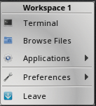

.. index:: preface
.. _Preface:

Preface
*******

This section covers the legal considerations and typographic conventions
in this handbook.

Typographic Conventions
=======================

The |lumina| Handbook uses several typographic conventions.
:numref:`Table %s <typconv>` provides a simple reference for these
conventions:

.. _typconv:

.. table:: : Text Formatting Examples

   +---------------------+-------------------------------------------+
   | Item                | Visual Example                            |
   +=====================+===========================================+
   | Graphical elements: | Click the :guilabel:`Import CA` button.   |
   | buttons, icons,     |                                           |
   | fields, columns and |                                           |
   | boxes               |                                           |
   +---------------------+-------------------------------------------+
   | Menu selections     | Click :menuselection:`System --> Videos`. |
   +---------------------+-------------------------------------------+
   | CLI Command name    | Use :command:`scp`.                       |
   +---------------------+-------------------------------------------+
   | Command line sample | :samp:`[tmoore@example] ls /etc`          |
   +---------------------+-------------------------------------------+
   | Files, volume and   | Locate the :file:`/etc/rc.conf` file.     |
   | dataset names, and  |                                           |
   | directories         |                                           |
   +---------------------+-------------------------------------------+
   | Keyboard keys       | Press the :kbd:`Enter` key.               |
   +---------------------+-------------------------------------------+
   | Important points    | **This is important.**                    |
   +---------------------+-------------------------------------------+
   | Values entered into | Enter *127.0.0.1* in the address field.   |
   | fields, or device   |                                           |
   | names               |                                           |
   +---------------------+-------------------------------------------+

.. index:: legal
.. _Legal:

Legal
=====

This section covers the required legal elements to the handbook,
including the Copyright notice, Trademarks used in the document, and the
|lumina| ethical advertising policy.

.. index:: copyright, trademarks
.. _Copyright:

Copyright & Trademarks
----------------------

Copyright © 2005-2017, iXsystems

The |lumina| Handbook is freely available for sharing and redistribution
under the terms of the
`Creative Commons Attribution License <https://creativecommons.org/licenses/by/4.0/>`_.
This means you have permission to copy, distribute, translate, and adapt
the work as long as you attribute the |lumina| Project as the original
source of the Handbook.

|trueos| and the |trueos| logo are registered trademarks of
`iXsystems <https://www.ixsystems.com/>`_. To use the |trueos| logo in
your own works, please ask for permission first from
marketing@ixsystems.com.

|lumina| and the |lumina| logo are registered trademarks of
`iXsystems <https://www.ixsystems.com/>`_. To use the |lumina| logo in
your own works, please ask for permission first from
marketing@ixsystems.com.

|sysadm| is a trademark of `iXsystems <https://www.ixsystems.com/>`_.

|trpi|, |pise|, and |picl| are trademarks of
`iXsystems <https://www.ixsystems.com/>`_.

AMD is a trademark of Advanced Micro Devices, Inc.

Apache is a trademark of The Apache Software Foundation.

|appcafe| is a registered trademark of
`iXsystems <https://www.ixsystems.com/>`_.

Asus® and Eee PC® are registered trademarks of ASUSTeK® Computer Inc.

Facebook® is a registered trademark of Facebook Inc.

Flash® is a registered trademark of Adobe Systems Incorporated in the
United States and/or other countries.

FreeBSD® is a registered trademark of the
`FreeBSD Foundation <https://www.freebsdfoundation.org/>`_.

|freenas| is a registered trademark of
`iXsystems <https://www.ixsystems.com/>`_.

Intel, the Intel logo, Pentium Inside, and Pentium are trademarks of
Intel Corporation in the U.S. and/or other countries.

Java™ is a trademark of Oracle America and/or its affiliates in the
United States and other countries.

LinkedIn® is a registered trademark of LinkedIn Corporation.

Linux® is a registered trademark of Linus Torvalds.

Mac and Mac OS are trademarks of Apple Inc., registered in the U.S. and
other countries.

NVIDIA® is a trademark and/or registered trademark of NVIDIA Corporation
in the U.S. and other countries.

ThinkPad® is a registered trademark of Lenovo.

Twitter is a trademark of Twitter, Inc. in the United States and other
countries.

UNIX® is a registered trademark of The Open Group.

VirtualBox® is a registered trademark of Oracle.

VMWare® is a registered trademark of VMWare, Inc.

Windows® is a registered trademark of Microsoft Corporation in the
United States and other countries.

.. index:: ethical advertising
.. _Ad policy:

Ethical Advertising Policy
--------------------------

For many years, users have wanted to give back to the |lumina| project.
Generally, we encouraged users to donate or actively contribute to the
FreeBSD project to ensure FreeBSD continues to be successful in the
future. Because |lumina| is open source software, we have included a
minimal number of ads as a simple method for users to give back to the
project, if they wish.

The primary consideration for these ads is to avoid detracting from the
user experience as much as possible. To this end, any ads in the
Handbook will be limited to the navigation sidebar, and only in a
predefined space underneath all other navigation options. We are
resolved to protect user privacy and security, and do not collect user
information, with the exception of click throughs. Furthermore, we do
not collect any data for targeted ads, and are committed to only show
high quality ads pertaining to our user base.

**Cookie Policy**

Clicking on a Newegg ad directs users through an affiliate link that
gives the |lumina| project a modest commission based on any items
purchased within 24 hours. This is a simple time tracking cookie used to
ensure the |lumina| project is afforded its commission. To ask questions
about our Ethical Advertising policy, please contact joshms@trueos.org
for more information.

.. index:: lumina introduction
.. _Introduction to Lumina:

Introduction to |lumina|
************************

The Lumina Desktop Environment (|lumina| for short) is a lightweight,
XDG-compliant, BSD-licensed desktop environment focused on streamlining
work efficiency with minimal system overhead. It is specifically
designed for |trueos| and FreeBSD, but has also been ported to many
other BSD and Linux operating systems. It is based on the Qt graphical
toolkit and the Fluxbox window manager, and uses a small number of X
utilities for various tasks, such as :command:`numlockx` and
:command:`xscreensaver`.

|lumina|'s features include:

* Very little system overhead.

* Does not require any of the desktop implementation frameworks such as
  DBUS, policykit, consolekit, systemd, or HALD.

* Does not come bundled with any applications such as web browsers,
  email clients, multimedia software, or office suites. Instead, it
  provides utilities for configuring the desktop environment.

* Uses a simple, text-based 
  `configuration file <https://github.com/trueos/lumina/blob/master/src-qt5/core/lumina-desktop/defaults/luminaDesktop.conf>`_
  for setting system-wide defaults. |lumina| distributors can use this
  file to easily preset the |lumina| defaults and interface for their
  distribution.

* Provides a plugin-based interface design. The user can make their
  desktop as light or heavy as they wish by choosing which plugins to
  have running on their desktop and panels. This plugin-based system is
  similar to Android or other modern operating systems.

* A single, easy-to-use :ref:`Configuration` utility controls all
  the different configuration options for the desktop in one location.

* Intelligent "favorites" system for creating quick shortcuts to
  applications, files, and directories.

* ZFS file restore functionality through the
  :ref:`Insight File Manager`.

* Multi-monitor support includes the :ref:`Xconfig` graphical utility
  for adding or removing monitors from the |lumina| session.

* Simple system controls through the system menu for configuring audio
  volume, screen brightness, battery status/notifications, and workspace
  switching.

* Total system search capabilities through the resource friendly
  :ref:`Lumina Search` utility.

* Screenshot functionality through |lumina| :ref:`Screenshot`, which is
  also tied to the :kbd:`Print Screen` key by default.

.. _Install and Start:

Install and Start
=================

|lumina| is available as a pre-built package for numerous operating
systems. The `Get Lumina® <http://lumina-desktop.org/get-lumina/>`_
section of the webpage includes installation instructions for each
supported system.

In addition to pre-built packages, the
`Lumina® source repository <https://github.com/trueos/lumina>`_
is available on GitHub so that developers can contribute code or create
packages for other distributions. If you plan to compile |lumina| from
source, refer to the
`DEPENDENCIES <https://github.com/trueos/lumina/blob/master/DEPENDENCIES>`_
file and ensure all dependent software is installed and to the
`README <https://github.com/trueos/lumina/blob/master/README.md>`_ file
for build instructions.

After installing |lumina|, no startup configuration is needed when
installed on a |trueos| system as the PCDM login manager will
automatically display |lumina| in the login menu. Simply log out, select
|lumina|, and log back in.

.. note:: When using a system with no graphical login manager, type
          :command:`start-lumina-desktop` to start |lumina|.

The rest of this Handbook describes the Lumina Configuration utility,
other various utilities built into |lumina|, and |lumina| plugins. Also,
the handbook shows how to be involved improving |lumina|, as well as
reproducing the change log for each major release of |lumina|.

.. _Initial Settings:

Initial Settings
================

When freshly installed, |lumina| will implement a number of default
plugins and options for the user. All these first time defaults are
configurable, with the numerous options covered in the :ref:`Plugins`
section of the handbook.

.. note:: The default desktop appearance can vary if using another
   distrubution's custom configuration of the |lumina| Desktop Project.

.. _lumina1:

.. figure:: images/lumina1e.png
   :scale: 50%

   Lumina Desktop

:numref:`Figure %s <lumina1>` is a screenshot of Lumina using its
default settings. The user has clicked the "|lumina|" icon in order to
open the start menu.

The Start Menu provides quick access for user interaction with the
system. The top frame is a search bar for rapidly finding specific
items. Just underneath the search bar is a small field indicating which
user is logged in. Also, If the system has a battery, you can hover over
the battery icon (not pictured) on the opposite side of the user name to
display the current status of the battery and the estimated time
remaining if the battery is discharging. The remaining space of the
start menu is divided into several categories:

* **Favorites:** This element is the largest section of the menu. Click
  an entry to launch that application. Right-click an entry to
  :guilabel:`Remove from Favorites` or to
  :guilabel:`Add to Quicklaunch`. In |lumina|, Favorites appear in this
  section of the start menu and :guilabel:`QuickLaunch` adds a button
  for the application to the panel next to the :guilabel:`Start Menu`.

* **Browse Files:** Used to browse for files and directories using the
  :ref:`Insight File Manager`. One available action in this file manager
  is the ability to add a file or directory to the list of Favorites.
  Simply select the file or directory and click the :guilabel:`star`
  icon in Insight.

* **Browse Applications:** Click this entry to browse all applications
  currently registered on the system. Applications are listed
  alphabetically by category. The :guilabel:`Show Categories` button has
  three modes which are changed by clicking the button: category names
  (checked box), no categories (unchecked box), and categories with
  contents (half-checked box).

  Click an application's name to start the application. Right-click an
  application's name to view choices for :guilabel:`Pin to Desktop`,
  :guilabel:`Add to Favorites`, or :guilabel:`Add to Quicklaunch`. Using
  |trueos| or another operating system with a pre-defined application
  store will add a :guilabel:`Manage Applications` button at the top of
  the applications list. Click it to open the specific operating
  system's application store. For example, on a |trueos| system,
  :guilabel:`Manage Applications` opens |appcafe|. Click
  :guilabel:`Back` to return to the start menu.

* **Control Panel:** If using |trueos| or an operating system with a
  control panel, click this entry to open the operating system's
  control panel.

* **Preferences:** Click this entry to access a number of options:

    * **Configure Desktop:** This entry opens the :ref:`Configuration`
      utility.

    * **Lumina Desktop Information:** Click the :guilabel:`?` icon to
      determine the installed version of |lumina|.

    * **System Volume:** Use the mouse to move the volume control
      slider to change the system audio volume from 0% to 100%. Click
      the sound icon on the left to mute or unmute the speaker. If the
      operating system provides a mixer utility, click the speaker icon
      on the right to launch the mixer utility for advanced control of
      the audio system.

    * **Screen Brightness:** Use the mouse to move the brightness
      control slider from 10% to 100%.

    * **Workspace:** The number of available virtual workspaces are
      listed. Click the right or left arrow to switch between
      workspaces.

    * **Locale:** This will only appear if the lumina-i18n package is
      installed. The current locale will be displayed as the title of
      the drop-down menu. Click the drop-down menu to select another
      locale for this session. Refer to :ref:`User Settings` for more
      information on fine-tuning the locale settings.

    * **Back:** Click to return to the start menu.

* **Leave:** Click this entry to view options to
  :guilabel:`Suspend System` (if supported by the operating system,
  press the system's power button to login and resume operation),
  :guilabel:`Restart System` (if the user has permission),
  :guilabel:`Power Off System` (if the user has permission),
  :guilabel:`Sign Out User`, or press :guilabel:`Back` to return to the
  start menu. Alternately, click the :guilabel:`lock` icon next to
  :guilabel:`Leave` to lock the system, which will start the screensaver
  and password prompt to resume the session.

.. note:: On a |trueos| system currently applying updates, the
   *shutdown* and *restart* options are disabled until the updates are
   complete. A popup indicates updates are in progress.

.. _Default Keyboard Shortcuts:

Default Keyboard Shortcuts
--------------------------

By default, |lumina| utilizes a large number of keyboard shortcuts, as
seen in :numref:`Table %s <lumdefkbd>`. Many of these shortcuts are
derived from *fluxbox* defaults, as noted in the table.

.. TODO Update table when rework goes live (est. v1.30 release)

.. _lumdefkbd:

.. table:: : |lumina| keyboard shortcuts

   +----------------+---------------------------------------+---------+
   | Shortcut       | Function                              | Default |
   +================+=======================================+=========+
   | Alt + click    | Move window                           | Fluxbox |
   | (open window)  |                                       |         |
   +----------------+---------------------------------------+---------+
   | Alt + right    | Resize window                         | Fluxbox |
   | click (open    |                                       |         |
   | window)        |                                       |         |
   +----------------+---------------------------------------+---------+
   | Alt + middle   | Lower window                          | Fluxbox |
   | click (open    |                                       |         |
   | window         |                                       |         |
   +----------------+---------------------------------------+---------+
   | Ctrl + click   | Attach windows                        | Fluxbox |
   | + drag (window |                                       |         |
   | titlebar)      |                                       |         |
   +----------------+---------------------------------------+---------+
   | Alt + Tab      | Next window                           | Fluxbox |
   +----------------+---------------------------------------+---------+
   | Alt + Shift +  | Previous window                       | Fluxbox |
   | Tab            |                                       |         |
   +----------------+---------------------------------------+---------+
   | Ctrl + Tab     | Next group                            | Fluxbox |
   +----------------+---------------------------------------+---------+
   | Ctrl + Shift + | Previous group                        | Fluxbox |
   | Tab            |                                       |         |
   +----------------+---------------------------------------+---------+
   | Windows Key +  | Next (Fluxbox) Tab                    | Fluxbox |
   | Tab            |                                       |         |
   +----------------+---------------------------------------+---------+
   | Windows Key +  | Previous (Fluxbox) Tab                | Fluxbox |
   | Shift + Tab    |                                       |         |
   +----------------+---------------------------------------+---------+
   | Alt + Left     | Arrange windows in a tiled state. The | Fluxbox |
   | Arrow          | active window moves screen left.      |         |
   +----------------+---------------------------------------+---------+
   | Alt + Right    | Arrange windows in a tiled state. The | Fluxbox |
   | Arrow          | active window moves screen right.     |         |
   +----------------+---------------------------------------+---------+
   | Windows Key +  | Move to a specific tab in the current | Fluxbox |
   | <1-9>          | window.                               |         |
   +----------------+---------------------------------------+---------+
   | Alt + F1       | Opens Lumina default terminal         | Lumina  |
   +----------------+---------------------------------------+---------+
   | Alt + F2       | Opens :command:`lumina-search`        | Fluxbox |
   +----------------+---------------------------------------+---------+
   | Alt + F4       | Close open window                     | Fluxbox |
   +----------------+---------------------------------------+---------+
   | Alt + F5       | Kill the open window's process.       | Fluxbox |
   +----------------+---------------------------------------+---------+
   | Alt + F9       | Minimize open window                  | Fluxbox |
   +----------------+---------------------------------------+---------+
   | Alt + F10      | Maximize open window                  | Fluxbox |
   +----------------+---------------------------------------+---------+
   | Alt + F11      | Fullscreen open window                | Fluxbox |
   +----------------+---------------------------------------+---------+
   | Windows Key +  | Send current window to previous/next  | Fluxbox |
   | <Left & Right  | workspace.                            |         |
   | Arrows>        |                                       |         |
   +----------------+---------------------------------------+---------+
   | Ctrl + Windows | Send current window to previous/next  | Fluxbox |
   | Key + <Left &  | workspace and follow the window.      |         |
   | Right Arrows>  |                                       |         |
   +----------------+---------------------------------------+---------+
   | Windows Key +  | Change to a specific workspace.       | Fluxbox |
   | F1-12          |                                       |         |
   +----------------+---------------------------------------+---------+
   | Ctrl + Windows | Change to a specific workspace with   | Fluxbox |
   | Key + F1-12    | the active window.                    |         |
   +----------------+---------------------------------------+---------+
   | Print          | Open :command:`lumina-screenshot`     | Lumina  |
   +----------------+---------------------------------------+---------+
   | Pause          | Lock the system                       | Lumina  |
   +----------------+---------------------------------------+---------+
   | Alt + L        | Lock the system (alternate)           | Lumina  |
   +----------------+---------------------------------------+---------+
   | Alt + Space    | Open :command:`lumina-search`         | Lumina  |
   +----------------+---------------------------------------+---------+
   | Alt + PgUp     | Increase system volume                | Lumina  |
   +----------------+---------------------------------------+---------+
   | Alt + PgDn     | Decrease system volume                | Lumina  |
   +----------------+---------------------------------------+---------+
   | Alt + Home     | Increase brightness                   | Lumina  |
   +----------------+---------------------------------------+---------+
   | Alt + End      | Decrease brightness                   | Lumina  |
   +----------------+---------------------------------------+---------+
   | F12            | Open the Lumina default terminal      | Lumina  |
   +----------------+---------------------------------------+---------+
   | Windows Key    | Open the default "Start Menu"         | Lumina  |
   +----------------+---------------------------------------+---------+

.. _Panel and System Tray:

Panel and System Tray
=====================

By default, |lumina| provides a panel at the bottom of the screen with a
system tray at the far right of the panel. This section describes the
default layout. For instructions on how to configure the panel, refer to
the :ref:`Interface` section.

When opening windows or applications, a button will be added to the
section of the panel near the start menu. If the application provides
an icon, the button will appear with the icon and descriptive text.
Mouse over the button to show the full name of the application. Each
open window or application will have its own button on the panel. Click
a button to make that window active; click it again to minimize it.

Right-click the title of an open window to open a menu of options,
including stick, layer/dock, and set transparency, among other options.

The system tray is located in the right portion of the panel. Any
applications that register a tray icon will appear in this area. For
example, on a |trueos| system, icons will appear for Life Preserver,
Mount Tray, and |sysadm|. Refer to :ref:`Interface` for instructions on
modifying which applications appear in the system tray. Click or
right-click an icon to interact with an application directly. The
current system time shown by the clock is in the default format for the
current locale. Click the :guilabel:`clock`, then hover over
:guilabel:`Time Zone` to open the time zone menu. From here, select
either :guilabel:`Use System Time` or hover over a country name in order
to select a city to change to that city's time zone.

.. index:: desktop context menu
.. _Desktop Context Menu:

Desktop Context Menu
====================

Right-clicking the desktop will open a menu of quick shortcuts with the
title of the menu indicating the name of the current workspace, as seen
in :numref:`Figure %s <conmen>`.

.. _conmen:

   Default Context Menu

This section describes the default menu items. For instructions on how
to configure the right-click menu, refer to the :ref:`Interface`
section of this handbook.

By default, the right-click menu contains the following items:

* **Terminal:** Used to launch a system terminal. The default is
  :command:`xterm`, but this is customizable.

* **Browse Files:** Launches the default file manager.
  (:ref:`Insight File Manager` for Lumina)

* **Applications:** Provides shortcuts to the operating system's
  graphical software management utility (if available), the control
  panel (if the operating system provides one), and the applications
  currently registered on the system, arranged by system category.

* **Preferences:** Contains shortcuts to the screensaver preferences,
  desktop utility (:ref:`Configuration`), display configuration
  (:ref:`Xconfig`), the operating system's control panel, and
  |lumina| version information contained within
  :guilabel:`About Lumina`.

* **Leave:** Opens the system log out window, with options to log out of
  the desktop session, restart the system (if the user has permission),
  shutdown the system (if the user has permission), cancel the log out
  window, lock the system, or suspend the system (if the operating
  system supports suspend mode).
