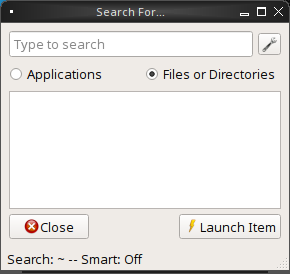
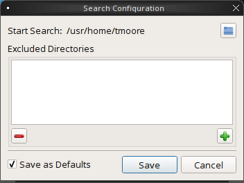
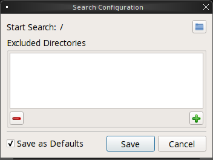
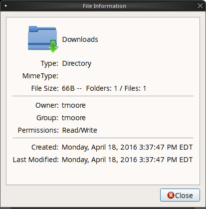
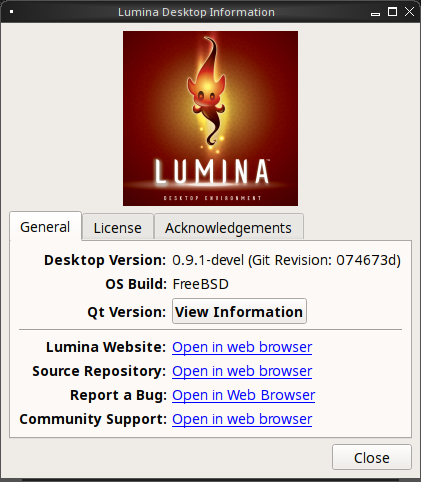

.. index:: Utilities
.. _Lumina Utilities:

Lumina Utilities
****************

Lumina provides many built-in utilities, which are described in this 
chapter.

.. index:: screenshot
.. _Lumina Screenshot:

Lumina Screenshot
=================
   
This utility can be used to take screenshots of the desktop or selected 
window and save them as PNG image files. To launch this utility, click 
the start menu and select :menuselection:`Browse Applications --> Utility --> Lumina Screenshot`,
right-click the desktop and select :menuselection:`Applications --> Utility --> Lumina Screenshot`,
type :command:`lumina-screenshot` from a terminal window, or press the 
:kbd:`Print Screen` button.

On the "New Screenshot" tab, seen here in :numref:`Figure %s: New Screenshot Tab <lumina9a>`
the following settings can be used to fine-tune the screenshot:

.. _lumina9a:

.. figure:: images/lumina9a.png
   :width: 351px
   :height: 310px
   :scale: 100%
   
* **Entire Session:** will take a screenshot of the entire screen.

* **Single Screen:** in a multi-monitor setup, you can select which 
  screen number to use for the screenshot.

* **Single Window:** will screenshot a selected window. Simply choose 
  "Single Window," then the "Take Screenshot" button, and click on the 
  desired window. The "Include Borders" checkbox can be used to 
  determine whether or not the screenshot of the window is surrounded by
  a black border.
  
* **Delay:** in seconds. This can be used to give you time to setup the 
  screenshot.

There are three options for taking a screenshot: clicking the "Take 
Screenshot" button in the lower-right corner of Lumina Screenshot, 
pressing :kbd:`Ctrl+N`, or clicking :menuselection:`File --> Take Screenshot`. 

After capturing a screenshot, the "View/Edit", seen here in :numref:`Figure %s: View/Edit Tab <lumina25>`
tab provides additional options for manipulating the screenshot:

.. _lumina25:

.. figure:: images/lumina25.png
   :width: 351px
   :height: 310px
   :scale: 100%
   
* **Image Preview:** displays the captured screenshot. Right clicking 
  the image will provide options for zooming in or out. Left click and 
  dragging across the image will highlight an area which can be cropped 
  by pressing the "Crop" button in the lower-right corner.
  
* **"Save As":** button to open a window where you can specify the 
  filename and location for saving the screenshot.

* **Launch Editor:** button to launch a selectable image manipulation 
  program.

Additionally, clicking :menuselection:`File --> Quick Save` will 
automatically save the screenshot to the default "Pictures" directory 
and open a window to select an image manipulation program.

.. index:: file manager
.. _Insight File Manager:

Insight File Manager
====================
  
The Insight file manager, shown in :numref:`Figure %s: Insight File Manager <lumina10a>`,
allows the user to easily browse and modify files on the local system on
a per-directory basis. To open Insight, click the start menu and select 
"Browse Files", right-click the desktop and select "Browse Files", or 
type :command:`lumina-fm` from an xterm.

.. _lumina10a:

.. figure:: images/lumina10a.png
   :width: 569px
   :height: 442px
   :scale: 100%
   
It is possible to open up additional directories through the tab system 
using :kbd:`Ctrl-T` or by clicking :menuselection:`File --> New Browser`,
allowing the user to easily manage multiple locations on the system. 
Insight also features the ability to "bookmark" locations on the system 
for instant access via the "star" button. Once a location has been 
bookmarked, it will be available via the "Bookmarks" menu at the top of 
the window. Any removable devices that are available on the system will 
show up in the "External Devices" menu, if supported by the operating
system. When an item is selected, the icons on the left side of the 
screen provide the possible actions that may be taken with regards to 
that item. Possible actions include: "open item", "open item" (will 
prompt to select the application to use), "add item to personal 
favorites", "rename item", "cut items (add to the clipboard)", "copy 
items to the clipboard", "paste items from clipboard", and "delete 
items". By default, the action buttons are visible. They can be made 
invisible by clicking :menuselection:`View --> Show Action Buttons`. To 
disable thumbnails, uncheck :menuselection:`View --> Load Thumbnails`. 
Note that this option does not remove thumbnails that have already been 
loaded, it only prevents loading thumbnails in new directories. Hidden 
files are not shown by default; this can be changed by checking 
:menuselection:`View --> Show Hidden Files`.

If you select a file or directory and right-click it, the following 
options become available: "Open", "Open With" (where you select the 
application to use), "Rename", "View Checksums" (shows the MD5 
checksum), "Cut Selection", "Copy Selection", "Paste", "Delete 
Selection", "File Properties" (such as file type, size, permissions, and
creation date), or "Open Terminal here".

A few additional options may be available at the bottom of the window, 
depending on the directory being viewed and the types of files that are 
in it:

* **New file:** the ability to create a new file is available if the 
  user has permission to modify the contents of the current directory.

* **New Dir:** the ability to create a new directory is available if the
  user has permission to modify the contents of the current directory.

* **Slideshow:** if there are image files in the directory, this option 
  will display those image files as a slideshow and provide arrows for 
  going forward or back by one file or to the very beginning or end of 
  the file list. Buttons are also provided for deleting the currently 
  displayed image or to rotate it, and save the rotation, clockwise or 
  counter-clockwise.

* **Play:** will appear if there are supported multimedia files in the 
  directory. The types of files that are supported depends on what 
  multimedia plugins are installed on the system. If a particular file 
  is not recognized as a multimedia file, install the associated 
  multimedia codec using the operating system's application management 
  software and restart the file manager.

* **Backups:** if the system is formatted with ZFS and snapshots of the 
  current directory are available, this button will appear. Snapshots 
  are organized from oldest to newest, with the most recent snapshot 
  selected by default, and the contents of the directory at the time of 
  that snapshot are displayed. To restore a file or multiple files, 
  select them from the list and click the "Restore Selection" button. If
  those files still exist and you want to overwrite them, make sure the 
  "Overwrite Existing Files" option is checked first. Otherwise, if a 
  file with that name exists, the restore will append a number to the
  end of the filename. For example, the first restored version of 
  :file:`testfile.txt` will become :file:`testfile-1.txt`.
  
.. index:: application launcher
.. _Lumina Open:

Lumina Open
===========
   
To open a file, directory, or URL from the command line, use 
:command:`lumina-open` followed by the full path to the file or the URL.
This utility will look for an appropriate application to use to open the
specified file or URL. If there is no default application registered for
the input type, a small dialog will prompt the user to select which 
application to use, and optionally set it as the default application for
this file type. As seen in the example shown in :numref:`Figure %s: Lumina Open <lumina11b>`,
this dialog organizes the available applications into three types: 

.. _lumina11b:

.. figure:: images/lumina11b.png
   :width: 309px
   :height: 257px
   :scale: 100%
   
* **Preferred:** these applications have registered their Mime type with
  the system and can open that type of file. Also included are any 
  applications that have been used to open this type of file before as 
  it keeps track of the last three applications used for that file type.

* **Available:** displays all the applications installed on the system, 
  organized by category and name.

* **Custom:** lets the user manually type in the binary name or path of 
  the application to use. It also provides a search button to let the 
  user graphically search the system for the binary. Whenever text is 
  entered, a check is performed to determine whether that is a valid 
  binary and the icon will change between a green checkmark or a red X 
  as appropriate.

.. index:: search
.. _Lumina Search:

Lumina Search
=============
  
Lumina Search provides the ability to easily search for and launch 
applications or to quickly search for file and directories. The "*" 
wildcard can be used in the search terms and the search will include 
hidden files if the search term starts with a dot ("."). 

To start this utility, type :command:`lumina-search` or go to the start 
menu :menuselection:`Browse Applications --> Utility --> Lumina Search`.
:numref:`Figure %s: Search for Applications <lumina13b>` shows a 
screenshot of this utility.

.. _lumina13b:

   
To open an application, begin to enter its name. The box below the 
selected "Applications" button will display any matching application 
names. Select the desired application and click the "Launch Item" button
to open it.

If you click the "Files or Directories" button, the screen changes 
slightly, as seen in :numref:`Figure %s: Search for Files <lumina26>`.

.. _lumina26:

   
By default, a "Files or Directories" search is limited to the user's 
home directory, as indicated by the "Search: ~" at the bottom of the 
screen. The "Smart: Off" indicates that every subdirectory is included 
in the search; in other words, there are no excluded directories. To add
additional search directories or to exclude subdirectories, click the 
wrench icon to see the screen shown in :numref:`Figure %s: Configuring the Search Directories <lumina14a>`.

.. _lumina14a:

   
Click the blue folder icon to change the starting search directory. For 
example, you can select "Computer" then "/" from the "Select Search 
Directory" screen to search the entire contents of the computer. You can
also add directories to exclude from searches by clicking the "+" 
button. If you add any excludes, you can delete an exclude by 
highlighting it and clicking the "-" button. By default, the "Save as 
Defaults" option is selected. Unselect this option if you only wish to 
temporarily modify your search settings.
      
.. index:: Lumina File Information
.. _Lumina File Information:

Lumina File Information
=======================

The :command:`lumina-fileinfo` utility can be used to open a graphical 
window summarizing the size, permissions and ownership, creation time, 
and last modification time of the specified file or directory. In the 
example shown in in :numref:`Figure %s: Sample File Information <file1a>`,
the user has typed :command:`lumina-fileinfo Downloads` from a terminal 
window to view the file information of their :file:`~/Downloads` 
directory.

.. _file1a:

.. index:: Lumina Information
.. _Lumina Information:

Lumina Information
=======================
  
This utility provides information about the version of Lumina, as well 
as the license, acknowledgements, and Project links. To launch this 
utility, right-click the desktop and select :menuselection:`Preferences --> About Lumina`,
click the start menu then the question mark icon in "Preferences", or 
type :command:`lumina-info` in a terminal window. An example is shown in
:numref:`Figure %s: About Lumina <about1b>`.

.. _about1b:

   
The "General" tab contains the following information:

* **Desktop Version:** indicates the version of Lumina.

* **OS Build:** indicates the operating system that was used to build 
  this version of Lumina.

* **Qt Version:** click the "View Information" button to display the QT 
  version and its license.

* **Lumina Website:** click the "Open in web browser" link to open 
  `<http://lumina-desktop.org/>`_ in the default web browser.

* **Source Repository:** click the "Open in web browser" link to open 
  `<https://github.com/pcbsd/lumina>`_ in the default web browser.

* **Report a Bug:** click the "Open in web browser" link to open 
  `<https://bugs.pcbsd.org/projects/pcbsd>`_ in the default web browser.
  Refer to :ref:`Report a Bug` for instructions on how to submit a bug 
  report.
  
The "License" tab contains the license text for Lumina. Lumina is 
licensed under a `3-clause BSD license <http://opensource.org/licenses/BSD-3-Clause>`_.

The "Acknowledgements" tab contains the following:

* **Project Lead:** the name of the Project's lead developer. Click the 
  name to open his profile on GitHub in the default web browser.

* **Contributors:** click the "Open in web browser" link to open 
  `<https://github.com/pcbsd/lumina/graphs/contributors>`_.

* **Sponsors:** lists the project and corporate sponsors of the Lumina 
  Project.

.. index:: Xconfig
.. _Lumina Xconfig:

Lumina Xconfig
==============
   
The :command:`lumina-xconfig` utility is a graphical front-end to the 
:command:`xrandr` command line utility. It provides the ability to probe
and manage any number of attached monitors. To start this utility, 
right-click the desktop and select :menuselection:`Preferences --> Display`
or type :command:`lumina-xconfig` from a terminal window. This will open
a screen similar to the one shown in :numref:`Figure %s: Configuring Monitors <lumina15a>`.

.. _lumina15a:

.. figure:: images/lumina15a.png
   :width: 410px
   :height: 343px
   :scale: 100%
   
In this example, two display inputs are attached to the system and their
current screen resolutions are displayed. If the display input supports 
multiple resolutions, they will appear in the "Resolution" drop-down 
menu so that you can select a different resolution. 

If you attach another display input, the "Add Screen" tab is activated 
so that you can configure the new input's resolution and whether or not 
it should be the default input.

.. index:: textedit
.. _Lumina Text Editor:

Lumina Text Editor
==================
 
The :command:`lumina-textedit` utility, seen in :numref:`Figure %s: Lumina Text Edit <lumina23>`
is a simple plaintext editor which features four primary elements: 
optional syntax highlighting, find/replace functionality, line 
numbering, and bracket highlighting. Additionally, colors can be 
customized by selecting :menuselection:`View --> Customize Colors`.

.. _lumina23:

.. figure:: images/lumina23.png
   :width: 507px
   :height: 532px
   :scale: 100%
